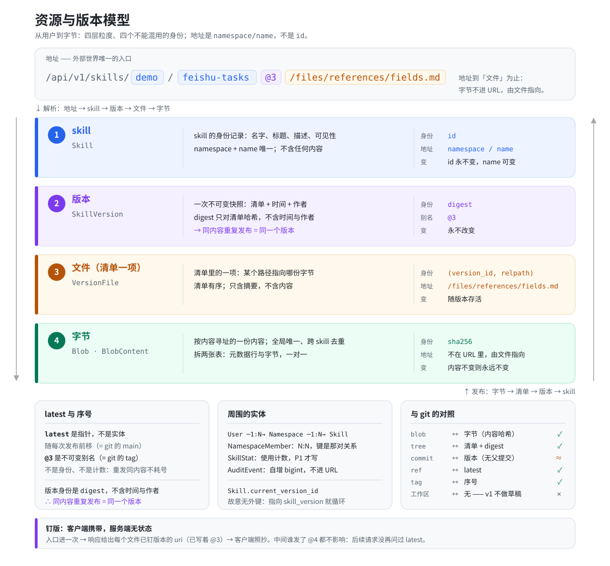

# 资源与版本模型（从用户到字节）

> **最后更新**：2026-10-07
> **本文是什么**：v1 的**概念模型**——从用户到字节有哪些实体、**每个实体的身份是什么**、彼此如何关联、如何寻址、版本的生命周期是什么。
> **本文不是什么**：不是表结构（那是 [`technical-design.md`](../versions/v1-hosting/technical-design.md) §3），不是接口形状（§4），也不是决策记录（那是 [`docs/decisions/`](../decisions/README.md)）。**本文不复述它们，只链接**——同一个事实只有一处权威位置。

## 一句话

> **字节按内容寻址、永远不可变；版本是「路径 → 字节」的清单加上时间、作者与状态；skill 是版本序列上的一个身份；名字是 skill 的地址，`id` 是 skill 的身份。**

四句话里每一句都对应一个实体，也对应一个不能混用的身份。混淆它们——尤其是把「版本名」当成「版本身份」——会直接导致地址不稳定、缓存失效、以及客户端永远认为内容变了。

## 一图总览



**怎么读**：顶上是外部世界唯一的入口——一条地址。它向下**解析**成四层，每层都有自己的身份，**没有一个身份可以跨层复用**；右边那条反向的箭头是**发布**，与解析走的是同一条链的两个方向。底部三块分别是 `latest` 与版本名的区别、不在脊柱上的周围实体、以及与 git 的对照。

图是本文的**渲染**，不是第二份权威——二者不一致时以正文为准（[`model-diagram.svg`](model-diagram.svg) 为手写源，改图请连同正文一起改）。

## 实体与关联

```
User ──1:N── Namespace ──1:N── Skill ──1:N── SkillVersion ──1:N── VersionFile
  │               │                 │                                    │
  │               └──N:N── User     │                                    │
  │                 (NamespaceMember)                                    │
  │                                 └── current_version_id ─────────┐    │
  │                                     （无外键，见下）              │    │
  └──1:N── AuditEvent                                                │    │
                                                                     ▼    ▼
                                              SkillVersion ◄──────────┘    │
                                                   │                        │
                                                   └──── VersionFile ──N:1── Blob ──1:1── BlobContent
                                                                              (元数据行)     (字节)
```

图上没有画进去的一条（因为画不下）：**`Skill ──1:N── SkillGrant ──N:1── User`**——「谁能读、谁能写**这一个** skill」（[ADR 0034](../decisions/0034-skill-level-sharing.md)）。它与 `NamespaceMember` 是**两件事**：后者说「谁能进我的命名空间」，它说「谁能读这一个 skill」。粒度不同，所以是两张表而不是一张表的两个角色。

逐个说：

| 实体 | 是什么 | 身份是什么 |
|---|---|---|
| **User** | 一个人/账号 | `id`（不透明 id）。**登录凭据是手机号，不进地址**；`handle` 是**用户名，也是个人命名空间的 slug** —— 两者刻意分开，见 [ADR 0013](../decisions/0013-phone-login-and-username-slug.md) |
| **Namespace** | 名字唯一的范围 | `id`。`slug` 是它在地址里的那一段 |
| **NamespaceMember** | 谁属于哪个命名空间、什么角色 | 复合键 `(namespace_id, user_id)`——它表达的是**关系**，主键就是那对关系 |
| **SkillGrant** | 谁能读、谁能在**某一个** skill 上提交版本（`viewer` / `editor`） | 复合键 `(skill_id, user_id)`。**挂在 `skill.id` 上而不是地址上**——地址会变，而授权是一条要活过改名的关系（[ADR 0004](../decisions/0004-opaque-id-primary-key.md) §理由 说的「将来的权益记录」就是它） |
| **Skill** | skill 的**身份**：名字、标题、描述、可见性、指向当前版本 | `id`（不透明 id）。`(namespace_id, name)` 唯一 |
| **SkillVersion** | skill 的一次**不可变快照**，外加一个会变的状态（`draft` / `published` / `discarded`） | `digest`——对清单算出来的摘要，**不含时间、作者与状态**。`id` 只是行主键，版本名是别名 |
| **VersionFile** | 清单里的一项：某个路径指向哪个字节 | 复合键 `(version_id, relpath)` |
| **Blob** | 一份字节的**元数据行**（大小、创建时间） | `sha256`——**内容本身就是地址** |
| **BlobContent** | 那份字节 | 同 `sha256`，与 `Blob` 一对一（分成两张表是为了分表空间、分开备份） |
| **SkillStat** | 使用计数（P1 才写） | `skill_id` |
| **AuditEvent** | 某事发生过的记录 | 自增 `bigint`——只追加、量最大、id 从不进 URL |

**`current_version_id` 故意没有外键**，因为它指向 `skill_version`，而后者又指回 `skill`，加了就循环。它是模型里唯一的这种指法，值**只由上线动作移动**——可以前进也可以回移，回移就是回滚（[ADR 0031](../decisions/0031-submitting-and-publishing-are-two-actions.md)）。

## 四层粒度，四个不能混用的身份

这是整个模型的骨架。**「资源」这个词在这四层上含义不同，定位它需要的信息也不同**：

| 粒度 | 身份 | 定位它需要 | 变不变 |
|---|---|---|---|
| **字节** | `sha256` | 只有 sha256（**全局唯一、跨 skill 去重**） | 内容不变则永远不变 |
| **文件**（清单一项） | `(version_id, relpath)` | 版本 + `relpath` | 随版本存活 |
| **版本** | `digest`（对清单哈希） | skill + 版本标识（版本名 / digest / 省略即 latest） | 内容**永不改变**；状态会变 |
| **skill** | `id`（身份）；`name` 是属性 | namespace + name | `id` 永不变；`name` 可变 |
| **latest** | **不是实体，是一个指针** | namespace + name（默认） | 只由上线动作移动（可回移） |

**「版本名」不是身份，是不可变别名。** 身份是 `digest`。名字一旦发出就永不指向别的内容（`UNIQUE(skill_id, version)`），所以它等价于 **git 的 tag**，而不是分支——这条性质是地址稳定性的全部依据。名字是**作者在 `SKILL.md` 顶层 `version:` 里声明的 semver**；**不声明就没有名字**，那一版只能按 digest 钉。服务端只校验它的**形状**，不校验它的含义——版本号是否真的反映了兼容性，是作者的声明，不是服务端的保证（[`ADR 0033`](../decisions/0033-version-names-are-semver.md)）。

## 术语

| 词 | 指什么 | **不要**指什么 |
|---|---|---|
| **skill** | 那条身份记录（有名字、有可见性、指向当前版本） | 不是某个版本的字节，也不是它的清单 |
| **版本** | 一次不可变的快照（= 清单 + 时间 + 作者 + 状态） | 不是「当前内容」——当前内容是指针的结果 |
| **清单**（manifest） | 「路径 → 字节摘要」的有序列表 | 不含内容；它是版本的身份来源 |
| **字节 / blob** | 按 sha256 存的一份内容 | 同一个字节可以被多个版本、多个 skill 共享 |
| **latest** | 一个**指针**，只由上线动作移动（可回移） | 不是一个版本，不能作为身份 |
| **版本名** | 版本的不变性别名，作者在 frontmatter 顶层 `version:` 里声明的 semver | 不是身份；不声明就没有名字（只能按 digest 钉）；服务端只校验形状，不校验含义 |
| **钉**（pin） | 请求里显式指定版本 | 不由服务端记忆，见下 |
| **提交**（submit） | 把一个 skill 目录传上去、产生一个 `draft` 版本 | 不是上线——提交不改动消费面看到的任何东西 |
| **上线**（publish） | 把某一版变成 `current_version_id` 所指的那一版 | 不是提交；它只在浏览器面存在（[ADR 0031](../decisions/0031-submitting-and-publishing-are-two-actions.md)） |
| **草稿**（draft） | 已提交、还没有人上线过的版本 | 不是本地副本——它在服务端、内容已不可变，只是消费面看不见 |
| **丢弃**（discard） | 把一个草稿标成永不上线 | 不是删除——行与字节都留着 |
| **授权 / 共享**（grant / share） | 把**一个** skill 给**一个**用户读或写，`viewer` / `editor` | **不是**成员关系——它不让人进入命名空间，也不给「读这个 skill」以外的任何东西；**也不是** `visibility`，被授权的 skill 仍然是 `private` |

## 寻址

**地址是 `namespace/name`，不是 `id`**——`id` 只做内部身份（外键、审计、版本归属都指向它），不进 URL。**一个用户可以拥有多个命名空间**（见上面的实体图，`namespace.owner_user_id` 上也没有唯一约束）；v1 在注册时为他建**一个**个人命名空间，slug 就是他的 handle。建库能力与「发布落到哪一个」留给后续版本。

**第一段是不是「我的」，读和写给的答案不同**（[ADR 0034](../decisions/0034-skill-level-sharing.md)）：

- **写**：仍然是「必须是我自己的命名空间」——创建一个 skill 只能在自己那里。
- **读**：**不必是**。被授权给调用者的那个 skill 在**别人**的命名空间里，而地址的第一段就是那个别人的 slug。它不是绕过——那正是授权要表达的东西，`list` 会把这样的地址连同前缀一起列出来。

```
/api/v1/skills/demo/feishu-tasks                      latest——每次请求重新解析
/api/v1/skills/demo/feishu-tasks@1.2.3                钉在这一版（版本名是不可变别名）
/api/v1/skills/demo/feishu-tasks@sha256:…             钉在内容上（清单每条 `uri` 与 `@版本` 都用它）
/api/v1/skills/demo/feishu-tasks@1.2.3/files/references/fields.md
```

**同一个钉也可以写在请求头里**（`X-Skill-Version: 1.2.3`，语法与 `@` 后缀同一套），只在 `/api/v1` 的读接口上生效——URL 保持不变而版本随请求走。**它与地址里的钉同时给出却不一致时是 400**：两个来源说不同的话，说明调用方自己也不知道要哪一版，那必须响，不能靠「谁优先」猜。

**地址不解析就没有更多可说的**：没有这个 skill、不是你的、skill 已软删、版本不存在——四种情况**同一个 404 与同一个错误码**。多一个码就多一处可以用来探测的信息。

### 钉版：客户端携带，服务端无状态

「一次任务里版本钉死」听起来像会话，但**服务端不知道什么是「一次任务」**——v1 是无状态的 bearer 令牌，没有任何东西能标识「这是同一任务的第二次请求」。所以钉必须是**数据**，而且由客户端携带。

**在客户端这一侧，它具体放在哪里，是 [ADR 0035](../decisions/0035-the-pin-lives-on-the-client-machine.md) 决定的事，不是这个模型的：** 一度是调用方手里的文本（印在地址里、整段照抄），现在**CLI 在 `invoke` 时解析一次、记在本机**，之后每次请求把这个值放进 `X-Skill-Version`。两条路都满足上面那句话——钉仍然是随请求走的数据，服务端仍然不知道它从哪儿来。

请求内部仍然是同一条链：

1. 客户端**进一次**（地址裸名，钉在请求头里）。
2. 响应把版本解析出来，并给**每个文件一条已经钉好版本的 `uri`**。
3. 客户端**照抄那些 `uri`**——它们里面已经写着 `@1.2.3`（不声明版本名的版本则写着 `@sha256:…`）。

于是中间谁发布了 `@1.3.0` 都不影响这次任务：**不是服务端记住了什么，而是后续请求根本没再问过 latest。**

反过来，**「每次调用都从入口进」就是每次重新解析**，任务中途会漂——漂的结果是清单与取回的字节对不上，而且不报错。这正是 [ADR 0012](../decisions/0012-addressing-and-version-pinning.md) 要修的那个漏洞。

**消费面要查三个条件**：「skill 活着」、「这个版本存在」、**且「这一版已上线」**。软删之后 `skill_version`/`version_file` 行**都还在**，所以把判断写成「版本行还在就发」会变成「删了还能读到」；漏掉第三个条件，则「v1 已上线、v2 刚提交」时 `@2` 会把没人批过的内容发出去。**作者面（`/web`）只要前两个**——它本来就是要看得见草稿的那一面。

## 与 git 的对照

模型与 git 同构，但**有两处关键不同，都是为了别的东西有意换来的**：

| git | 这里 | 是否一致 |
|---|---|---|
| blob（内容哈希寻址） | `blob` / `blob_content` | ✅ 完全一致 |
| tree（目录快照） | 清单 + `skill_version.digest` | ✅ |
| commit（tree + 父 + 作者 + 时间 + message） | `skill_version`（digest + 作者 + 时间 + changelog） | ⚠ 见下 |
| ref（可移动的名字，如 `main`） | `skill.current_version_id` = latest | ✅ |
| tag（不可移动，指向一个 commit） | 版本名（作者声明的 semver） | ✅ |
| 已提交、还没推送的提交 | `draft` 版本 | ⚠ 近似——这里的 draft 已经**在服务端**且**不可变**，而 git 的工作区在本地、随你改 |

**不同之一：这里的「版本」是 tree，不是 commit。** git 的 commit hash 含父提交、作者、时间与 message，所以同样内容提交两次得到**不同** hash；这里的 `digest` 只对清单哈希，所以**同样内容重复发布是同一个版本**。这是幂等发布与「客户端据此判断有没有变」的基础（[`ADR 0005`](../decisions/0005-content-addressing.md)），**不能为了像 git 而改**。

**不同之二：git 是 DAG，这里是单线。** 分支可以移动、可以分叉；latest 由上线动作移动，回退就是**上线一个旧版本**——同一个动作的另一种取值，不是另一套机制。所以 latest 像 `main`，但**没有别的分支**。

## v1 明确没有的

- **废弃状态**（把一个已上线的版本标成不再可用）。纯增列、不动存储模型，留到需要时加，成本几乎为零。**它和「丢弃」不是一回事**：丢弃只作用于草稿，废弃会作用于已上线的版本，而后者可能正被 `@N` 钉着。
- **作者面的版本管理接口**（`PATCH` 元数据、`restore`）。网页上已经有版本列表、原文与 diff，接口化的这两条还没做（[`technical-design.md`](../versions/v1-hosting/technical-design.md) §7 的 P2）。**消费面的 `GET …/{ns}/{name}/versions` 不在此列**——它随 P0g 落地了（§4.2），而且它只是「可 invoke 的版本」，不是作者要的版本历史。

**从这张清单上划掉的一条：回滚。** 上线一个旧版本就是回滚，它随 [ADR 0031](../decisions/0031-submitting-and-publishing-are-two-actions.md) 一起进了 v1（`technical-design.md` §7 的 P2 清单已划掉）。

**一条警告仍然成立，但对象变了。** 草稿**已经做了**，而且是普通 `skill_version` 行，`version_file` 照样引用着它的字节，清扫算得到它——那个坑不成立（[ADR 0031](../decisions/0031-submitting-and-publishing-are-two-actions.md) §理由）。**但若将来有人想把草稿挪进另一张表**，这条立刻重新生效：清扫算的是「`version_file` 里还引用着哪些 sha256」，只被那张表引用的字节**下一次发布就会被删掉，而且不报错**。

## 实现状态

| 部分 | 状态 |
|---|---|
| 实体与表结构 | **已实现**——17 张表，含版本名 `skill_version.version`（可空）与 `UNIQUE(skill_id, version)`；DDL 见 [`technical-design.md`](../versions/v1-hosting/technical-design.md) §3.3 |
| 版本名、清单每项带 `uri` | **已实现**（P0e，2026-10-07）——版本名由作者在 frontmatter 声明，详情把解析出的版本写进每条 `uri`；没有版本名的版本按 digest 钉（[ADR 0033](../decisions/0033-version-names-are-semver.md)） |
| 只给 L1 的读端点与请求头选版本 | **已实现**（P0e）——`GET /api/v1/skills/{ns}/{name}[@版本]/metadata`，以及读接口上的 `X-Skill-Version` |
| 钉由客户端记在本机、地址不带版本 | **已实现**（P0g，2026-10-07）——CLI 的 `invoke` 解析版本并记进用户配置目录下的 `pins-<server 哈希>`（macOS 是 `~/Library/Application Support/skillmaster/`），`read` 用 `X-Skill-Version` 发出去；`list` 印裸地址，卡片上的 `version` 字段随之删掉；新增消费面 `GET …/{ns}/{name}/versions` 只列已发布版本（[ADR 0035](../decisions/0035-the-pin-lives-on-the-client-machine.md)） |
| 版本三态（`draft` / `published` / `discarded`）与上线、丢弃两个动作 | **已实现**（P0d，2026-10-06）——[ADR 0031](../decisions/0031-submitting-and-publishing-are-two-actions.md)；迁移 `V10`、M7 的三态与两个作用域、作者面六个端点（含 diff）、网页 `/skills`、CLI 的 `submit` 都在。**未验证的是那一次联合手工验证**（提交 → 打开页面 → 点上线），见 [`test-plan.md`](../versions/v1-hosting/test-plan.md) §结果 |
| 按 `namespace/name[@版本]` 寻址 | **已实现**（P0c；`@版本` 的写法在 P0e 由序号换成 semver，`@sha256:…` 不变） |
| 按 `id` 寻址、无版本概念 | **已由上一行取代**——P0a 曾如此；`id` 现在只作内部身份，不进 URL |
| skill 级共享（`SkillGrant`） | **已实现**（P0f，2026-10-07）——[ADR 0034](../decisions/0034-skill-level-sharing.md) 的 `viewer` / `editor` 两个角色、「读 = 可读命名空间 ∨ 授权」「写 = 拥有 ∨ editor」、以及系统里**第一个 403** 都在：表由迁移 `V12` 建（DDL 见 [`technical-design.md`](../versions/v1-hosting/technical-design.md) §3.3），服务端三个授权端点 + `SkillSharingService`、网页的共享面板、CLI 的 `skill share` 都在；用例见 [`test-plan.md`](../versions/v1-hosting/test-plan.md) §用例「读取面与共享」（`SkillSharingIT` 12 例、网页 8 例） |
| 枚举一个版本的文件（`files`） | **已实现**（P0h，2026-10-07）——CLI 的 `skill files` 列出这一版每个文件的相对路径；清单来自详情接口那份本来就有的响应，**不新增端点、不新增权限**，走与 `read` 同一条读授权（[ADR 0036](../decisions/0036-enumeration-is-a-read.md)） |

**文档与代码在寻址上已经一致。** 从设计定稿到实现补齐之间有一个窗口，那时两者不一致是**有意的**（设计先定、实现随后）；那个窗口已关闭，TD §7 的 P0c 一节记着它交付了什么。
