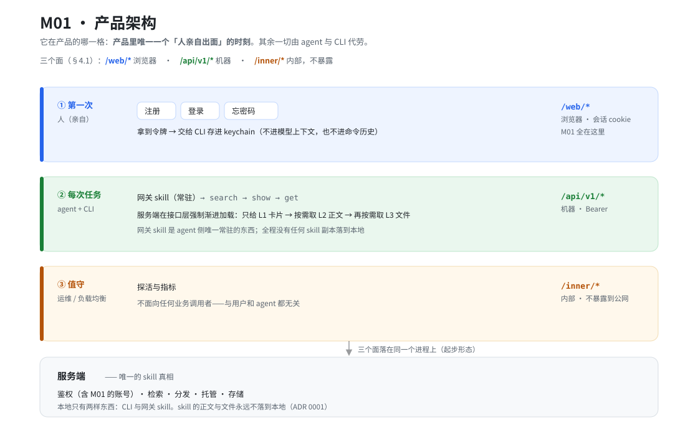
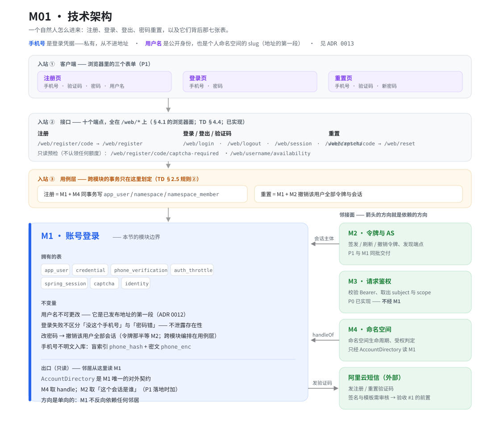

# M01 · 账号登录

## 产品架构

**怎么读**：产品里有三个角色，在**不同的时刻**、通过**不同的面**进来——`/web/*` 是人，`/api/v1/*` 是 agent 与 CLI，`/inner/*` 是运维（三个面见 TD §4.1）。**M01 只服务第一格**：它是唯一一个只在 `/web/*` 上服务的模块，因为**产品里唯一需要人亲自出面的地方就是这里**——其余一切由 agent 与 CLI 代劳。

## 技术架构

**怎么读**：左边三条竖箭头是**入站**——浏览器里的三个表单提交到 **6 个写端点 + 4 个读端点**（十个端点全在 `/web/*` 上，其中这 4 个读里有两个是只读预检：这个地址还要不要图形验证码、这个用户名还能不能用），跨模块的事务（注册、重置）由用例层编排，最后落进 M1 的边界内。右侧是**邻接面**，**箭头的方向就是依赖的方向**：M2 与 M4 的箭头指向 M1（它们依赖 M1 的只读出口），而 M1 指向阿里云短信的箭头是反的（M1 依赖它）。M3 没有箭头——它不经 M1。

两张图都是本文的**渲染**，不是第二份权威——二者不一致时以正文为准，`.svg` 为手写源，**改图请连同正文一起改**。

> 模块编号、包名与「分期」的权威是 [`technical-design.md`](../../versions/v1-hosting/technical-design.md) §2.5 那张模块表；这一篇写的是**这个模块自己的事**——它为什么存在、边界在哪、拥有什么、对外契约是什么。两者分工与 [`docs-architecture`](../../../.claude/skills/docs-architecture/SKILL.md) 的约定一致，**这里不重列那张表**。

包名 `com.skillmasterai.modules.account`：仓储与 SQL 在 `internal/` 下，包外不得引用。

## 职责

**账号与凭据的生命周期**：注册、登录、登出、密码重置，以及它们背后那几张表。

一句话判据：**「这个人是谁、他凭什么证明」属于 M1；「他能做什么」不属于它。**

## 边界

| 邻接模块 | 分界 |
|---|---|
| **M2 令牌与 AS** | M1 结束时凭据已验证、浏览器会话已建立；**令牌的签发、刷新、撤销是 M2 的事**。M1 不持有 `access_token` / `refresh_token`。 |
| **M3 请求鉴权** | M3 校验 Bearer 取出 subject（P0 已实现，走 `TokenValidator` 接缝）。M1 的产物是「这一次登录成没成」，M3 的产物是「每一个请求的调用者是谁」。 |
| **M4 命名空间** | 注册要在**同一个事务**里写 `app_user` **与** `namespace` + `namespace_member`——事务边界在用例层（TD §2.5 规则②），所以注册的编排不在 M1 里。M1 只回答「这个用户的 handle 是什么」（[`AccountDirectory`](../../../skillmaster-server/src/main/java/com/skillmasterai/modules/account/AccountDirectory.java)），命名空间的生命周期与受权判定归 M4。 |

## 拥有的表

| 表 | 为什么属于这里 |
|---|---|
| `app_user` | 账号本身。身份是 `id`（ULID）；**`handle` 是公开身份，手机号是登录凭据，两者刻意分开**（[ADR 0013](../../decisions/0013-phone-login-and-username-slug.md)）。 |
| `credential` | 口令哈希，主键 `(user_id, type)`。表留着 `totp` 的位子，v1 只写 `password`。 |
| `phone_verification` | 短信验证码的短时状态：手机号、用途（注册 / 重置）、码的哈希、过期时间、尝试次数。 |
| `auth_throttle` | 频控计数（短信冷却 / 日限 / 按 IP；登录按手机号 / 按 IP；图形验证码按 IP）。一张表而不是每条规则一次计数查询：短信按条计费，而没有计数器的登录端点就是一台在线密码预言机。 |
| `captcha` | 图形验证码的挑战：答案的哈希、过期时间、尝试次数。形状与 `phone_verification` 一样，理由也一样——真正的防线是寿命与尝试上限，不是哈希。 |
| `spring_session`、`spring_session_attributes` | 浏览器会话，**框架的表**。原设计里的 `browser_session` 已删（[ADR 0014](../../decisions/0014-browser-session-via-spring-session.md)）。DDL 由 `V3__account_login.sql` 建、逐字抄自 Spring Session 的 `schema-postgresql.sql`，所以它归 M1——`TableOwnershipTest` 要求迁移建出来的表都得有主。**这里没有任何一行 SQL 可以写这两张表名**，读写全走框架。 |
| `identity` | 外部身份提供方，预留 SSO。**成本为零且现在就要留**：把 provider 降级成一行数据是 ADR 0007 的决定，将来接飞书只是加一行。 |

**DDL 在 TD §3.1**——「这一版建哪些表」是版本的事。这一篇只说为什么是这几张、以及它们各自的身份。

## 不变量与规则

### 注册

- 四样输入：**手机号、验证码、密码、用户名**，缺一不可。
- 成功时**同事务**写 `app_user`（`handle` = 用户名，`phone_hash` / `phone_enc`）+ `credential(password)` + `namespace`（`slug` = handle）+ `namespace_member(role='owner')`。
- 用户名撞上保留名（如 `skillmaster`）要翻译成字段级 `400`，**不是 500**：这一条靠 `UNIQUE(handle)` 与 `UNIQUE(namespace.slug)` 兜底，不靠一份要靠人记得查的名单。
- 注册成功即建立浏览器会话（密码刚刚由本人设置，少一次登录摩擦）。

### 用户名

- 字符集是 **ASCII**：`^[a-z0-9][a-z0-9-]{5,29}$`，即 **6–30 字符**。理由不是洁癖——非 ASCII 会被百分号编码，而 `%` 与 `;` 已经实测过会让地址取不到（[`test-plan.md`](../../versions/v1-hosting/test-plan.md) §已知问题 4）。**下限是 6 而不是 3**（[迭代 0011](../../versions/v1-hosting/iterations/0011-register-flow-and-sms-state.md)）：它是命名空间，短名是最稀缺、也最容易被拿去冒充的那一批，而下面那条说它改不了——占了就不还。
- **不可更改。** 它是已发布地址的第一段，而地址是版本钉的、会被客户端抄走（[ADR 0012](../../decisions/0012-addressing-and-version-pinning.md)）。注册页必须写明这一点，并提示别用真实姓名或手机号。
- **注册前可以先问它能不能用**：`GET /web/username/availability`，与注册共用同一套规则。**它不是账号存在性预言机**——用户名本来就出现在每个已发布地址的第一段（[ADR 0013](../../decisions/0013-phone-login-and-username-slug.md)）；但它是一个可枚举的负载入口，所以按 IP 限流。

### 密码

- **只允许 ASCII 可打印字符**（U+0020–U+007E）：中文、全角、emoji、控制字符一律拒。理由见 [ADR 0017](../../decisions/0017-password-printable-ascii-only.md)——全角与半角肉眼不可区分，且每个字符 3 字节，能绕过黑名单。
- **长度 8–72 字节**。字节数在这里等于字符数（非 ASCII 已被上一条拒掉），但计数仍按字节，因为 72 这个数是 BCrypt 的。
- **没有字符类要求**（不要求含数字/符号/大小写），**但不得是常见密码**：一份 vendored 的 SecLists 名单（10001 条，来源与 sha256 记在 `PasswordBlocklist` 的注释里）+ 「以用户名开头、其后只剩数字」与「包含手机号」两条派生规则。命中一律回 `too_common`。见 [ADR 0016](../../decisions/0016-password-blocklist-not-composition.md)。
- 判序：**空/纯空白 → 字符集 → 太短 → 太长 → 与用户名相同 → 与手机号相同 → 常见**。**顺序是契约**：字符集先于长度，是因为对一个中文密码答「太短」，作者会去补更多中文；一个又短又等于用户名的密码要被告知「太短」，因为答「这是你的用户名」会让人去改一件不是问题的事。两条规则的理由是同一个。
- **「空白」按 Unicode 的 White_Space 属性判**（`common/Text.isBlank`；用户名与手机号共用），前后端是**同一张表**——不吃各自语言的内置（Java 的 `isBlank()` 不收不换行空格，JS 的 `trim()` 收），否则同一串 NBSP 在一侧是「没填」、在另一侧是「格式错」。见 [`iterations/0008`](../../versions/v1-hosting/iterations/0008-blank-criterion-alignment.md)。
- **改动只影响新设的密码**：登录从不校验密码形态，策略只在注册与重置被调用，所以收紧规则不需要任何人重置密码——**但收紧字符集这件事有时机性**：若是上线之后才收，用中文或全角设过密码的人会直接登不进去。

### 登录

- 输入是**手机号 + 密码**。
- 失败一律**不区分**「没这个手机号」与「密码错」——与「私有 skill 是 `404` 而不是 `403`」是同一条规则：不泄露存在性。
- 校验 `status = 'active'`；`suspended` 的账号保留数据，只是登不进来。
- **`suspended` 只在登录那一刻拦得住。** 已经签发的会话与令牌不因 `status` 变更而失效，所以「停用」必须走一个用例：改 `status` **与撤销该用户的全部凭据在同一个事务里**（会话这一半是 M1 的 `WebSessionRegistry`，令牌那一半要调 M2 的 `revokeAllFor`）。**代价是「停用」只能有一个入口**——散在多处就会漏掉撤销那一边。见 [M02 §撤销](M02-token-and-as.md)。
- **两条退避规则的计数方式不同，这个不同是有意的**：
  - **按手机号**：鉴权**之前**就计，成功后清零（所以累积的是「连续尝试」）。代价是知道某个号码的人能在窗口内把账号主人锁在外面——窗口短、上限小就是为这个。它计的是尝试，因为「停止猜测」比「描述猜测」重要。
  - **按地址**：**只由失败计**，成功不花也不清零。地址不是人——一个办公室或运营商的 NAT 从同一个地址来——所以每次尝试都花的预算最终会拒掉密码正确的人；而「成功可清零」会让持有一个账号的攻击者反复重置他花在别人身上的预算。
  - 拒绝时**已计的账要落库**（`noRollbackFor`）：地址规则的判断在鉴权之后，若整笔回滚会把手机号的计数一并抹掉，那个账号的猜测就再无上限。
- 「调用方地址」取自 `request.getRemoteAddr()`，而服务端显式声明认 `X-Forwarded-For` / `X-Forwarded-Proto`；**前提是反代覆写这两个头**，取舍见 [ADR 0018](../../decisions/0018-caller-address-behind-the-proxy.md)。
- 发送验证码另有冷却（按手机号，一分钟）与日限，以及一条按地址的上限；签发图形验证码按地址限流。三条都记在同一个 `auth_throttle` 的 `Rule` 枚举里。

### 找回密码

- 手机号 + 验证码 + 新密码。
- **必须撤销该用户的全部会话**。漏了这条，重置等于没重置——旧密码还开着门，而重置的人通常正是想关门。撤销按 `principal_name` 一查即得，因为会话是以 **userId** 索引的（见下）。
- **M2 的表那一半还没做**：`access_token` / `refresh_token` 的撤销要等令牌存在。届时是在同一个用例里多一行调用，不是返工——跨模块编排本来就归用例层（TD §2.5 规则②）。这一条如实记在 [`test-plan.md`](../../versions/v1-hosting/test-plan.md) §已知问题。

### 图形验证码

- **在发短信之前**：`/web/register/code` 与 `/web/reset/code` 都要带 `captcha_id` + `captcha_answer`。**登录不要求**——它不花钱，而且已经有一道按手机号的退避。
- **注册的第一次不要**：每个地址每个窗口的第一次注册发码免这一关，那两个字段传 `null` 即可（[ADR 0020](../../decisions/0020-first-code-send-without-a-captcha.md)）；之后每次都回到这里。**找回密码不适用**——它能拿走一个账号，所以每次都过。其余情况缺了图形验证码答 `{field: captcha, issue: required}`（400）：那不是「做错了什么」，而是「该把图摆出来」。
- **有一个只读的问法**：`GET /web/register/code/captcha-required` 答「下一次注册发码要不要图形验证码」。它**不认领也不消耗**那次免费额度——为什么非得如此，见 [ADR 0020](../../decisions/0020-first-code-send-without-a-captcha.md)。
- **答案由 `SecureRandom` 生成，不是库的默认值**：Hutool 的默认生成器走 `RandomUtil.getRandom()` → `ThreadLocalRandom`，不是密码学安全的。库只负责画图（字形、旋转、干扰线），随机数的那一半自己拿。
- **顺序是：手机号格式 → （认领免费额度 或 图形验证码）→ 频控 → 发送。** 频控计数计的是「本来要发出去的消息」，所以被图形验证码拒掉的请求不能动它——否则打错一个字母的人会被告知等一分钟，而计数也变成了「尝试数」而不是「发送数」。**认领排在这里还有第二个作用**：被频控拒掉时整笔事务回滚，那次免费额度自动退回——没发出去就不该花掉它。
- 单次使用、5 分钟、3 次尝试、签发按 IP 限流（120/小时）。**哈希不是防线**：四个字符一百万种取值，离线几秒就枚举完了。

### 短信验证码

- **一次一个用途**：`register` 发的码在 `reset` 上不认。用途存在行里，不是靠请求的形状判断——否则两个流程里弱的那条就成了进强那条的路。
- **猜错的次数必须活过回滚。** 拒绝是用抛异常表达的，而抛异常会回滚事务，于是「记一次猜错」这件事本身会被撤销——六位数字就能在一分钟内枚举完，**而且除了专门钉它的那一条，所有测试都是绿的**。两个用例因此都声明 `noRollbackFor = VerificationCodeException`；那条声明之所以安全，是因为**码的校验排在所有写入之前**，所以那一刻待提交的只有计数器本身。
- 六位数字的哈希挡不住枚举，**真正管用的是过期时间与尝试次数上限**——不要指望哈希。
- **当前不比对**（`skillmaster.sms.accept-any-code`，默认 `false`；要用就在 `.env` 里打开，`.env.example` 里以注释形式给出）：任意六位数字都通过。它存在是因为签名与模板还没过审、真码发不出来，而整条流程要先能走通（[迭代 0011](../../versions/v1-hosting/iterations/0011-register-flow-and-sms-state.md)）。**摘掉的只有比对这一步**：码仍要先请求过（没有未消费的行就拒）、仍 5 分钟过期、仍只能用一次、仍三次尝试——所以流程的形状与真码时**一模一样**。**生产前必须关掉**，而且配上 AccessKey 还开着它会**启动失败**，不靠人记得。

### 凭据怎么存

- 密码：BCrypt。
- 手机号：**盲索引 + 密文**两列。查询走 `phone_hash`（HMAC-SHA256，唯一索引），需要展示时才解 `phone_enc`（AES-GCM）。明文不入库，理由照 [ADR 0007](../../decisions/0007-self-built-oauth-as.md) 那句「数据库泄露不等于令牌泄露」。
- 验证码：存 `sha256(手机号 + 验证码)`。六位数字的哈希挡不住枚举，**真正管用的是过期时间与尝试次数上限**——不要指望哈希。

## 对外契约

**`AccountDirectory`——唯一的出口**，只读，传普通值（`String`）出去。

要紧的不是它有多小，而是它是邻居能看见 M1 的**全部**。两个消费者，都直接由 TD §2.5 规则① 推出来（一个模块只能读写自己拥有的表）：

| 谁 | 要什么 | 为什么不能自己读 |
|---|---|---|
| **M4 命名空间** | `handleOf(userId)`——个人命名空间的 slug 就是 handle | `app_user` 是 M1 的表 |
| **M2 令牌与 AS**（落地时接） | 「这个会话是谁」——`/oauth/authorize` 要拿会话的 user | 会话是 M1 的。**但 M2 不需要向 M1 要**：Spring Session 把 `SecurityContext` 存进会话，M2 读它、调 `getName()` 就拿到 userId |

依赖方向因此固定在 **M2、M4 → M1**，不会出现环（M1 不反向依赖任何邻居）。

**对 M2 的接缝是框架契约，不是本模块的 API**——这是[选 Spring Session 换来的主要好处](../../decisions/0014-browser-session-via-spring-session.md)。两边只约定一件事，而它是承重的：

> **`WebAuthentication.getName()` 返回 userId，`getPrincipal()` 也是它。** Spring Session 按 principal name 建索引（所以「撤销这个人的全部会话」是一次查找而不是扫表），M2 的 AS 会把这个名字放进它签发令牌的 `sub`。**写成用户名不会让本模块任何一条测试变红**，只会让这两件事静默失效。

**对外的 HTTP 面全在 `/web/*` 上**（§4.1 的浏览器面：十个端点，其中两条是只读预检，见下图与 TD §4.4）——M1 是唯一一个**只**通过 `/web/*` 服务的模块，因为它服务的是人，不是 agent。线格式是版本的事，在 TD §4.4。

## 为什么这样切

- **凭据与身份分开**，因为三者的生命周期完全不同：`id` 永不变，`handle` 不可改但可停用，凭据（口令、将来的 SSO 绑定）会被替换。合在一起，改密码就成了改身份。
- **会话与令牌分开**（M1 管的浏览器会话对 M2 的 `access_token`），因为它们面向的对象不同：一个是浏览器里的一次登录，一个是 API 上的一个凭据。混在一起，登出就没法只登出一边。这一条也正是[把会话交给框架](../../decisions/0014-browser-session-via-spring-session.md)之后仍然成立的东西——换的是会话的实现，不是这条边界。
- **注册留在用例层编排，而不是 M1 自己开事务**，因为它要同时写 M1 与 M4 的表，而 TD §2.5 规则②说跨模块事务只能由用例层划定。

## 实现状态

**已实现**（2026-10-01 起：[`iterations/0002`](../../versions/v1-hosting/iterations/0002-m01-login-server.md)、[`0003`](../../versions/v1-hosting/iterations/0003-captcha-and-sms.md) 图形验证码与短信、[`0011`](../../versions/v1-hosting/iterations/0011-register-flow-and-sms-state.md) 免费首发与两条只读预检）。

| 项 | 状态 |
|---|---|
| 表 | **已落**，走新增的 `V3__account_login.sql`（不是改 V1——理由见 TD §7 的 P1）。 |
| `AccountDirectory` | **已实现**（`handleOf`），P0 起供 M4 用。这一轮**没有加方法**，也不该加：M2 要的东西由框架契约满足。 |
| `app_user` / `credential` / `phone_verification` / `auth_throttle` / `spring_session*` | **已实现**。 |
| 注册 / 登录 / 登出 / 重置 + `/web/session` | **已实现**，十个端点在 TD §4.4。 |
| 图形验证码 | **已实现**：`captcha` 表 + `GET /web/captcha` + 发码端点的校验。**注册的第一次发码免它**（ADR 0020），并有一个只读的 `captcha-required` 告诉前端要不要把图摆出来。画图用 Hutool，答案用 `SecureRandom`。 |
| 短信发送 | **已接阿里云官方 SDK**（`AliyunSmsSender` + `SmsGateway` 那道缝，SDK 只出现在 `config/SmsConfig`）。**与阿里云的真实往返未验证**，见下。 |
| 验证码比对 | **当前关着**（`accept-any-code`，见上）。**上线前必须打开**，而它不是「还没做」——它在等签名过审。 |
| 令牌（M2） | 未实现。所以验收第 1 条里「拿到令牌」这半句**仍未成立**。 |

### 还没做的

| 没做 | 为什么 |
|---|---|
| **阿里云短信的端到端验证** | 代码接完了，但**一次真实往返都没跑过**：签名与模板还没过审、也没有凭据（TD §8 问题 12）。这不是「没做」，是「没验证」——`AliyunSmsSenderTest` 钉住的是代码这一侧的全部。**等待期间用 `accept-any-code` 顶着**，那个口子必须在上线前关掉。 |
| ~~**令牌撤销**（重置密码时）~~ | **已实现（2026-10-05）**：M1 撤销会话那一半一直在，M2 那一半当时只到接口与实现，没有调用者；现在 `ResetPasswordUseCase` 里是相邻的两行，用例走 `POST /web/reset` 真实入口（见 [M02 §撤销](M02-token-and-as.md)）。 |
| `/inner` 独立端口、`anyRequest().denyAll()` | 仍按 TD §7 的 P1 工作项留着。 |

### 已知的不精确

| 不精确 | 影响与边界 |
|---|---|
| **固定窗口**允许跨边界连发 | t=59s 与 t=61s 各一次，对「每分钟一条」的规则就是两条。滑动窗口要一次一行；对 60 秒的冷却，这个交换不划算。偏差以窗口长度为界，不是无界的。 |
| **登录退避在验密码之前** | 知道某人手机号的人可以在 15 分钟窗口内把他锁住。窗口短、上限小就是为这个——反过来（先验密码再计数）等于让攻击者一直猜下去。 |
| **`sms:cooldown` 按手机号，不分用途** | 刚发过注册码的号码，一分钟内发不出重置码。这是按「人」限流而不是按「流程」，是有意的；代价是一个真实用户偶发要多等一分钟。 |
| **密钥没有轮换方案** | 丢 `phone-hmac-key` 则所有账号按手机号找不回来，丢 `phone-enc-key` 则号码都显示不出来；没有重加密路径，也没有 key id 列。v1 可接受，作为开放问题记在 TD §8。 |
| **BCrypt 截断到 72 字节** | 不管它，两个不同的长密码能登同一个账号。**上限由密码策略在注册与重置那条路上把住**（超过 72 字节直接拒）；登录那条路不校验密码形态，`matches` 走的是比较路径、会静默截断——所以卡着 72 字节注册的密码，在后面追加任意内容也能登进去。代价为零（前 72 字节仍得知道），但「上限」是注册侧的规则，不是哈希类保证的。 |
