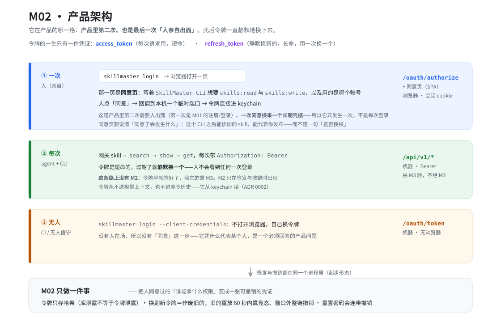
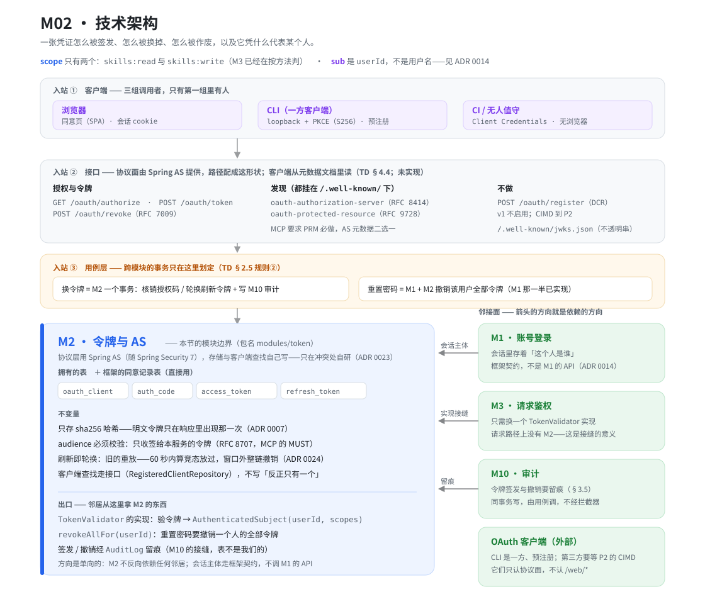

# M02 · 令牌与 AS

## 产品架构

**怎么读**：令牌的一生分**三个时刻**，而只有第一个时刻里有人。**① 一次·人**：`skillmaster login` 打开浏览器里的一页，上面写着 `SkillMaster CLI` 想要 `skills:read` 与 `skills:write`、以及用的是哪个账号，人点「同意」→ 回调到本机一个临时端口 → 令牌进 keychain。这是产品里**第二次、也是最后一次需要人亲自出面**的地方（第一次是 M01 的注册/登录）——**一次同意换来一个长期凭据**，所以它只发生一次，不是每次登录。**② 每次·静默**：此后每个任务都由 agent 拿 `Authorization: Bearer` 直接调接口，令牌短命、过期了就静默换一个，人看不到任何一次登录；**这条路上没有 M2**——令牌早就签好了，验它的是 M3。**③ 无人**：CI 用 `--client-credentials` 自己换令牌，没有人在场，所以**没有「同意」这一步**——「它凭什么代表某个人」于是变成一个必须回答的产品问题，而不是一个可以跳过的步骤。

## 技术架构

**怎么读**：左边三条竖箭头是**入站**——三组客户端（浏览器里的同意页、CLI 的 loopback PKCE、CI 的 client_credentials）打到**协议面**的端点上（`/oauth/authorize`、`/oauth/token`、`/oauth/revoke` 与两个发现端点；**路径是我们选的，但客户端不硬编码它**——它们从元数据文档里读），跨模块的事务（重置密码连带撤销令牌）由用例层编排，最后落进 M2 的边界内。右侧是**邻接面**，**箭头的方向就是依赖的方向**：M1 的箭头指向 M2（M2 要读会话主体），M3 与 M10 的箭头指向 M2（它们用 M2 的出口）。**M2 不反向依赖任何邻居**，而它与 M1 之间那道箭头走的是**框架契约、不是 M1 的 API**。

两张图都是本文的**渲染**，不是第二份权威——二者不一致时以正文为准，`.svg` 为手写源，**改图请连同正文一起改**。

> 模块编号、包名与「分期」的权威是 [`technical-design.md`](../../versions/v1-hosting/technical-design.md) §2.5 那张模块表；这一篇写的是**这个模块自己的事**——它为什么存在、边界在哪、拥有什么、对外契约是什么。两者分工与 [`docs-architecture`](../../../.claude/skills/docs-architecture/SKILL.md) 的约定一致，**这里不重列那张表**。

包名 `com.skillmasterai.modules.token`：仓储与 SQL 在 `internal/` 下，包外不得引用；`config` 要用的那三件（存储、生成器、客户端认证那对覆盖）因此是**包的公开类型**——`config` 看不见 `internal`，这是 `ArchitectureTest` 强制的。

## 职责

**凭据的生命周期**：把「人同意过的『谁能拿什么权限』」变成一张可撤销的令牌，然后刷新它、作废它、以及让客户端发现这一切要去哪里办。

一句话判据：**「这张令牌代表谁、能做什么、还算不算数」属于 M2；「这个请求有没有带一张有效令牌」不属于它**——那是 M3。

## 边界

| 邻接模块 | 分界 |
|---|---|
| **M1 账号登录** | M1 结束时**浏览器会话**已建立。M2 的 `/oauth/authorize` 需要知道「现在登录的是谁」，但**不需要向 M1 要**：Spring Session 把 `SecurityContext` 存进会话，M2 读它、调 `getName()` 就拿到 userId（[ADR 0014](../../decisions/0014-browser-session-via-spring-session.md)）。**令牌的签发、刷新、撤销是 M2 的事**；反过来 M1 的重置密码要在**同一个用例**里调 M2 撤销该用户全部令牌——编排在用例层，不在 M1 里。 |
| **M3 请求鉴权** | M3 拥有 `TokenValidator` 这个接缝与 401/403 的 MCP 形状；**M2 提供它的第二个实现**（P0 的实现是「从配置里解析一个静态令牌」）。请求路径上只有 M3——`/api/v1/*` 的每一次调用都不经 M2，这是接缝存在的全部意义。 |
| **M10 审计与统计** | 令牌的**签发与撤销要留痕**（§3.5 的清单里有这两项）。M2 调 `AuditLog.record(AuditEvent)`，与它描述的那次变更**同事务**——表不是 M2 的。 |
| **OAuth 客户端**（外部） | CLI 是一方、预注册的客户端，`client_id` 随 CLI 发布。第三方客户端要等 **P2 的 CIMD** 才接得进来；**DCR 从不启用**。它们只认协议面，不认 `/web/*`。**签发出的令牌落到客户端本机哪里，是客户端的事**：CLI 是 keychain 优先、明文文件兜底并告知（[ADR 0025](../../decisions/0025-cli-credential-storage.md)）——M2 不管这件事，也不该管。 |

## 拥有的表

**六张**：`V1__baseline.sql` 建的**四张**（第 108–238 行）——P0 就把它们当基线 schema 的一部分建了出来，尽管当时一行 Java 都没有；`V5` 加的一张**框架的同意表**；`V6` 加的**一次授权那一行**。`V9` 没有加表，只给那一行加了一列（见 §撤销）。理由写在 `ModuleMap` 的注释里：不列出来的话，「`access_token` 归谁」就无人可答，而 `TableOwnershipTest` 要求迁移建出来的每个表都得有主。

| 表 | 为什么属于这里 |
|---|---|
| `oauth_client` | 注册过的客户端。**v1 只有我们自己的 CLI 一行**（[ADR 0011](../../decisions/0011-server-and-cli-stack.md)）；`client_secret_hash` 对公共客户端为空——CLI 走 PKCE，不是机密客户端。`user_id`（`V5`）是无人值守的客户端代表谁（[ADR 0022](../../decisions/0022-unattended-client-bound-to-a-user.md)）。 |
| `oauth_authorization` | **一次同意**：谁、哪个客户端、哪些 scope、框架的 `state`，以及框架要在「授权请求」与「换令牌」之间带着走的东西（`V6`、`V7`）。它是另外三张表的父行——[[下面](#一次授权那一行-v6-补上的)说明它为什么非有不可]。`revoked_at`（`V9`）记着**这次授权结束了**，而它是「结束」这件事的**权威**，不是那三张表的副产物（见 §撤销）。 |
| `auth_code` | 授权码的一次性状态：发给了哪个客户端、哪个用户同意、回调到哪个 `redirect_uri`、PKCE 的 challenge 与 method、要哪个 audience、什么时候过期、**用过没有**。 |
| `access_token` | 每次请求用的短命凭据。**只存 sha256 哈希**；`revoked_at` 让它能立刻失效。 |
| `refresh_token` | 长命凭据，**用一次换一个**。`rotated_from` 把整条链串起来——窗口外重放任何一个祖先就整链撤销。 |
| `oauth2_authorization_consent` | 同意记录，**从框架那儿拿的**（[ADR 0023](../../decisions/0023-spring-authorization-server-with-our-own-storage.md)）。它由框架的 `OAuth2AuthorizationConsentService` 用，**我们不重写它**——那一块不与任何已有决定冲突（不涉及令牌哈希，也不涉及寿命分层）。它仍要进 `ModuleMap`，因为**每个迁移建出来的表都必须有主**，而那个断言是双向的。 |

### 「一次授权」那一行（`V6` 补上的）

`V5` 给三张表各加了一列 `authorization_id`，**但没有给它一个可以指向的东西，也没有给框架的 attributes 一个家**。把它补上的是 `V6` 的 `oauth_authorization`，而逼出它的**不是**设计推理，是**动手写存储**：PKCE 的校验读的就是 attributes。

- **框架在核心路径上读 attributes。** `CodeVerifierAuthenticator` 用 `getAttribute(OAuth2AuthorizationRequest.class.getName())` 取回授权请求，再从它的 `additionalParameters` 里拿 `code_challenge` 与出示的 `code_verifier` 比对。授权端点把它写进去，存储要是丢了它，**换令牌这一步根本走不完**。它至少是**大声失败**的（`"authorizationRequest cannot be null"`），没有静默降级。
- **这一列不是「优化」，是 PKCE 能不能成立。** 而 PKCE 是公共客户端的唯一证明。
- **`authorization_id` 因此从一根悬空的字符串变成了真的外键**，撤销也第一次有了「一行」可以够——而不是靠 `(client_id, user_id)` 那种会误伤同一个人在另一台设备上的另一条链的近似。
- **它没有推翻 `V5` 的分表。** 三张令牌表各自的寿命一点没变；来的这一张是它们的**父行**——同意、attributes、scope，它们活得比底下任何一张令牌都久。
- **令牌的元数据不用另存**：框架标的「已失效」与我们的 `revoked_at` 是同一件事，`isActive()` 能从现有的列答出来。唯一没存的是 claims——而那只对 JWT 或内省响应有意义，[ADR 0021](../../decisions/0021-opaque-tokens-not-jwt.md) 两条都没选。

### 写存储又挖出两处，都在这一行上

`V6` 的 `state` 缺口与它的 `attributes` 缺口是同一类：**设计推不出来，只有把真实端点跑起来才会撞上**，而且都表现为一个读起来像「客户端参数错了」的报错。

- **`V7` 补 `state` 一列。** 同意那一步用 `findByToken(state, …)` 反查授权——框架自己那张表就有一列 `state`，是为此而设的，我们没有地方放它。缺了它，每一次同意提交都被拒成 `OAuth 2.0 Parameter: state`：看起来是客户端回错了值，实际是服务端没有地方存那个对的值。**这一列是明文**，也是本模块唯一不是哈希的列：它是查找键不是凭据，框架拿它做等值比对，哈希掉就没法查了；§3.1 的「只存 sha256」说的是能换出访问权的令牌。
- **一个 `tokenType` 上的坑，写在这里免得下次重新推**：`findByToken` 的第二个参数**不可信**。框架用 `new OAuth2TokenType("code")` 去查授权码、用 `new OAuth2TokenType("state")` 去查授权，两种类型都不是本服务签发的令牌。所以我们的实现和框架自己那个 JDBC 实现一样，**忽略类型、把值和每个可能存值的列逐个比**——值都是 96 字节随机串，跨表撞上是不会发生的事。
- **`V8` 只改了一句话**：`V6` 的注释说 `oauth_authorization.id` 是 ULID，实际是框架给的 UUID——`OAuth2Authorization` 在我们被调用之前就已经带着它建好了，改它就会把行挂在调用方看不见的键上。**已应用的迁移不能就地改**（Flyway 校验和），所以用一条新的把注释改成真的：一句错的注释比没有注释更糟，因为它会被相信。

**DDL 在 TD §3.1**——「这一版建哪些表」是版本的事，而且**迁移脚本才是 DDL 的权威**（TD 里那份是转述）。这一篇只说为什么是这几张、以及它们各自的身份。

## 不变量与规则

### 授权码（人这一次）

- **PKCE 是必需的，且只接受 `S256`**（`auth_code.method` 的注释就是这么写的）。CLI 是公共客户端，没有 `client_secret`——PKCE 是它唯一的、也是规范要求的证明。
- `redirect_uri` **必须与注册时那个逐字相同**（`oauth_client.redirect_uris` 是 JSON 数组，token 请求里的那个必须是其中之一）。不做前缀匹配、不做规范化——回调地址上带着授权码，近似匹配就是把码送到别人手里。**唯一的例外是 loopback 的端口**（见下）。
- **loopback 的端口必须放开，这是规范要求**：CLI 向操作系统要的是一个**临时端口**，每次都不一样，所以逐字比对会让它永远对不上。[RFC 8252](https://www.rfc-editor.org/rfc/rfc8252.html) §8.4 的原话是 loopback 重定向「**除了端口那一部分，其余精确匹配**」。所以规则要分两条：
  - **非 loopback**：逐字相同。
  - **loopback**（`http://127.0.0.1:<任意端口>/callback`）：比 scheme + host + path，**端口任意**。
  - 附带一条：用 IP 字面量 `127.0.0.1` / `[::1]`，**不用 `localhost`**（RFC 8252 §8.3 明确不推荐）。
- **一次一码**：`used_at` 非空即已消费，第二次使用是**攻击而不是重试**。核销与签发在**同一个事务**里，否则并发两次兑换能各拿到一张令牌。
- `resource` 是 RFC 8707 的 audience，客户端要了才记；**要了就必校验**（见下）。
- 授权码是**分钟级**的。它的寿命只需要覆盖「回调到本机端口」那一次往返。
- **令牌不经过浏览器。** 浏览器携带的只有授权码——一次性的、分钟级的、绑定 PKCE 的。CLI 拿到码之后**自己直接**向 `/oauth/token` 换令牌。所以长期凭据从头到尾没经过浏览器，浏览器只是「证明这个人同意了」的通道。**这是这条流程能成立的安全前提**：一条 URL 上带的东西会被历史、插件、同步、截图带走，而授权码在别人能利用它之前就已经作废了。

**协议面上的实现细节**（按规范，没有分叉，记在这里免得实现时重新推）：

- **AS 那条链必须声明 `securityMatcher`**（`/oauth/**` + `/.well-known/**`）。**这不是洁癖，是启动条件**：不声明它就吃掉每一个请求，而 Spring Security 7 会**拒绝启动**并抛 `UnreachableFilterChainException`，明说后面那条链永远不会被走到。spike 里踩到过一次——顺带证明了框架宁可启动失败也不静默地让第一条链赢。
- **CLI 必须校验 `state`**：它自己生成、回调时逐字比对。这是 loopback 回调那道防线——没有它，别人可以让你的 CLI 拿着**他的**授权码去换令牌（你替他登录）。
- **未登录的落点是 `/login?return_to=<原始请求>`**，`return_to` 由 `TokenSecurityConfig` 里那个 entry point 拼出来（框架的 `LoginUrlAuthenticationEntryPoint` 只跳到页面、不带回来的路）。**参数名不是我们随便取的**：`LoginPage.vue` 早就在读它，并且按 **origin** 校验目的地（不是看开头几个字符——浏览器把 `\` 读成 `/`，`/\evil.example` 能骗过前缀检查）。没有它，人登录完落在首页，而 CLI 在 loopback 上等一个永远不来的回调。
- **loopback 监听要收紧**：只绑 `127.0.0.1`（**不是 `0.0.0.0`**，否则同网段的人都能打进来）、只接受第一个请求、验完 `state` 就关掉、加一个超时兜底（RFC 8252 §8 的做法）。临时端口只在这次请求期间开着。
- **PKCE 的 `code_verifier` 要校验形状**（RFC 7636：43–128 个字符、`[A-Za-z0-9-._~]`）——不校验的话，一个短 verifier 会让 `S256` 的强度名不副实。
- **`/oauth/token` 要限流**（按调用方地址，另按 `client_id`）：M1 的 `auth_throttle` 是现成的，加两条规则即可。授权码本身熵足够高、猜不出来，但端点不该是一个免费的枚举入口。
- **`audience` 的具体取值是本服务的 public base URL**（TD §4.5 那个 `skillmaster.public-base-url` 同一个值）——两个地方用同一个数，就不该写两遍。

### 同意（人这一次）

- **为什么要有这一步。** v1 只有我们自己的 CLI 一个客户端，而且是一方客户端，所以同意今天看起来有点像多余的动作。它仍然必须有，理由按分量排：
  1. **它是产品里唯一一次告诉用户「你交出去的是什么」的地方。** `skills:write` 意味着「这个 CLI 能以你的名义发布 skill」，而**用户点了 `skillmaster login` 不等于他知道这件事**。所以同意页要写清后果，不是一句「是否授权」。
  2. **更关键的是：它是「被记住」的那个对象。** 同意被存下来之后，第一次是「登录 → 同意 → 凭据」，**此后每次重新授权（凭据过期、换机器、重装）都是「登录 → 直接成功」**。所以「不需要第二次」这件事，恰恰是因为有第一次的同意被记下来了——**去掉这一步不是省了一步，是把摩擦换个地方收**。
  3. **它让 P2 不必重写一条安全关键路径。** 第三方客户端（CIMD）进来时同意是硬要求。现在建好，将来只是多一行数据；将来才建，动的就是授权流程本身。同一条论证见「客户端查找从第一天就走 `RegisteredClientRepository`」。
- **同意的维度是「用户」不是「用户 + 设备」**：键是 `(client_id, userId)`，也就是 `oauth2_authorization_consent` 的主键 `(registered_client_id, principal_name)`——正好是框架那张表，不用动它（判据同 [ADR 0023](../../decisions/0023-spring-authorization-server-with-our-own-storage.md)：只在冲突处自研）。
  - **「设备维度」不是一层安全控制，是假的**：设备标识只能由客户端自报（CLI 自己在本地生成一个 ID），所以攻击者要么**声称自己是已知设备**，要么干脆**点一下那个同意按钮**——因为驱动浏览器的就是他本人。它对诚实的用户加一次点击，对攻击者零成本。
  - 它连「提醒用户有人在新设备上授权」都做不到：同意页只挡得住「没在看这个页面的人」，而那个人不可能是发起者。
  - **代价（要记住，不要藏）**：用户维度意味着**任何拿到你会话的人，可以在他自己的机器上静默拿到一张 CLI 凭据，而用户看不到任何提示**。正确的缓解手段是**通知**（「一个新的 CLI 授权被创建」），不是设备维度——而通知 v1 没有。这条记在 [已知的不精确](#已知的不精确)。
- **同意只存在于人走的那条路。** `client_credentials`（[ADR 0022](../../decisions/0022-unattended-client-bound-to-a-user.md)）**没有同意**——没有人在场，同意无从谈起；它靠「注册时绑定了哪个用户」来约束。
- **同意页由 `skillmaster-web/` 提供**，框架通过 `consentPage` 指过去（[ADR 0015](../../decisions/0015-web-frontend-stack.md)、[ADR 0023](../../decisions/0023-spring-authorization-server-with-our-own-storage.md)）。**同意与撤销是两件事**：删掉同意记录不会撤销已经签发的令牌，两者各有各的入口。

### 刷新（此后每一次静默）

- **刷新即轮换**：每次刷新签发一个新的 refresh token，并把它要替换的那个写进 `rotated_from`。旧的随即失效。**这不是可选项**——[RFC 9700](https://www.rfc-editor.org/rfc/rfc9700.html) §2.2.2 对公共客户端是 MUST（sender-constrained 或轮换，二选一；CLI 没有 `client_secret`，所以只剩轮换）。
- **旧 token 被再次使用，分两段判**（[ADR 0024](../../decisions/0024-refresh-replay-grace-window.md)）：
  - **轮换后 60 秒内** → 算**竞态**，按正常刷新发一对新的，不撤销任何东西。
  - **窗口之外** → 算**重放**，**沿 `rotated_from` 回溯撤销整条链**。
  - 两段都要：只留严格段，一次并发刷新的输家把用户踢下线（而他的机器上什么都没做错）；只留宽松段，偷到旧令牌的人换出新令牌后正经用户只收到一个报错——**偷的人赢**。
  - **两段都在 `TokenStore` 里判，因为框架一个字都不做。** 框架的 refresh provider 对一个失效的 refresh token 只做一件事——抛 `invalid_grant`，既不撤销也不碰整条链。所以「窗口外撤销整条链」必须落在接口的这一侧（[ADR 0023](../../decisions/0023-spring-authorization-server-with-our-own-storage.md) 说规则归存储），而且**必须在它放弃之前**，因为它之后不会再回调我们。
  - **窗口只在家族还活着时生效。** 竞态总留下一个活的继任者；家族里一个活的都没有，说明这是**有人有意结束的**（`POST /oauth/revoke`、登出、`revokeAllFor`），窗口不得把它救回来。少了这个条件，一次登出之后的重试会拿到一对能用的新令牌——**一次只持续 60 秒的登出**。这个条件是写完之后被既有那条「撤销后刷新必须被拒」的 IT 当场逼出来的。
  - **撤销的范围是整条授权，不是沿 `rotated_from` 走一遍。** ADR 0024 要的是「别按 `(client_id, user_id)` 一锅端」，而一次轮换不改 `authorization_id`、一次授权就是一台设备上的一次登录——所以两者只在一个地方不同：窗口放行会造成**分叉**，而按授权撤销把两支一起收掉才是对的。理由写在 `TokenStore.revokeAuthorization`。
- **为什么会有竞态**：刷新是**每个 CLI 进程按需做**的，而 agent 一个任务会调 CLI 好几次（[ADR 0011](../../decisions/0011-server-and-cli-stack.md)）。两个进程同时看到过期、拿同一个 refresh token 各换一次——一个赢，另一个递的是已轮换掉的旧 token。
- **客户端另加一把锁**让竞态变稀（keychain 旁边），但窗口是兜底、不是可省的。锁只解决**同机**并发，而那正是我们的场景。
- **窗口内的盗用不会被发现**——这是买那几秒容错的价钱。
- **允许分叉**：窗口内放过的那次会再发一对新的，同一条链于是分成两支。清扫要按 token 逐个过期，**不能假设链是一条直线**。
- **判定读库，不读内存**：Keycloak 的 CVE-2026-9802 就是陈旧检测拿了进程启动时间，重启后已轮换的旧令牌又被接受。我们查 `rotated_from` 与库里的时间戳，重启不影响。
- **refresh token 必须会过期，而且是两把尺子**：**闲置 30 天**（多久不用就作废）+ **绝对上限 180 天**（即使天天用也强制重新授权一次）。[RFC 9700](https://www.rfc-editor.org/rfc/rfc9700.html) §4.14 建议的是闲置那一条；绝对上限的价值在于**保证一个被遗忘的凭据不会永远有效**，而且它强制了一次「人出面」——那是重新确认「这个人还在用这个账号」的唯一时机。
  - **跟上用户那个旋钮（未定）**：用户能选「保持登录多久」（一周 / 一月 / 长期），refresh token 的过期跟着它走，这样用户只需要理解**一个**寿命概念，而不是两个。**这个旋钮在产品里还不存在**——ADR 0024 提到了它，PRD 里没有，所以今天绝对上限是一个部署配置、不是一个人能选的东西。
  - **一个让风险比看起来小的性质**：因为轮换，**磁盘上那张 refresh token 每次用都会被换掉**。所以「长期」这个词有点误导——每天都用 CLI 的人，盘上那张最多只有几小时的历史。真正长期不变的是**不用它的人**手里那张。
- **刷新可以收窄 scope，不可以放大**（`refresh_token.scope` 的注释）。收窄是客户端在放弃权限，放大是把一次授权当成永久的提权入口。
- 令牌**过期了就静默换**——产品图第 ② 格那件事就落在这一条上。

### 无人值守

- `client_credentials` **没有授权码、没有同意页**——没有人可以同意。
- **它代表谁，是注册时定下来的**：`oauth_client` 上有一列 `user_id`，需要无人值守的客户端在注册时指定它代表哪个账号（[ADR 0022](../../decisions/0022-unattended-client-bound-to-a-user.md)）。于是 `access_token.user_id` **保持 `NOT NULL`**，M3 的 `AuthenticatedSubject(userId, scopes)` 也一个字不用改。
- **这一列只对无人值守那一路是权威**：交互式的公共客户端走授权码，它的 user 来自同意页，不来自这一列。
- **scope 上限挂在这个客户端上**，注册时定、不超过那个用户的权限——而不是每次换令牌时现判。
- **那一列还不存在**：`oauth_client` 是 `V1__baseline.sql` 建的，而 V1 已合进 `main` 并在本机应用过，所以这是一条**新的 `V5` 迁移**（改 V1 会要求每台已有库重建）。
- **「谁有权创建这样的客户端」v1 的答案是「没有入口，手工种一行」**：管理端写接口本来就没做，而 v1 这种客户端是个位数——部署时一条 `INSERT` 加一行、记在部署步骤里，不为此新写代码。自助创建要等「已授权的凭据」那类界面，而那已经推迟了。

### 令牌怎么存、怎么验

- **只存 sha256 哈希，明文令牌只在响应里出现那一次**（§3.1 实现约束 1）。数据库泄露不等于令牌泄露——这是 [ADR 0007](../../decisions/0007-self-built-oauth-as.md) 的原话。
- **令牌是不透明随机串，不是 JWT**（[ADR 0021](../../decisions/0021-opaque-tokens-not-jwt.md)）。理由只有一条是决定性的：**撤销要立刻生效**。JWT 要撤销就得再维护一份黑名单，于是又落回一次查库，白付了签名的复杂度与密钥轮换的债。代价是每个受鉴权的请求多一次主键查询——v1 规模下可忽略。
- **因此 `/.well-known/jwks.json` 不做**。MCP 只要求 protected resource metadata 必做、AS 元数据二选一，没要求 jwks。
- **令牌的熵是唯一的安全边界**：存的是**裸 sha256**（不加盐），所以一个可枚举的令牌等于没有哈希保护——生成必须用 `SecureRandom`。
- **`audience` 必须校验**：只接受签给本服务的令牌（§3.1 实现约束 2）。这是 MCP 规范的 MUST，在纯 API 下同样是对的——「这张令牌是签给谁的」与「它有没有过期」是两件事。
- **`access_token.client_id` 刻意没有外键**（注释里写了理由）：一张令牌会比客户端的注册记录活得久。
- **令牌是 bearer，只走 `Authorization` 头，绝不放在 query string**（[ADR 0007](../../decisions/0007-self-built-oauth-as.md)、TD §4.4）——规范要求，也防日志与 `Referer` 泄露。
- **`sub` 是 userId，不是用户名**：与 M1 的框架契约约定的是同一个值（`WebAuthentication.getName()`）。**写成用户名不会让本模块任何一条测试变红**，只会让「令牌代表谁」静默错位。
- **验令牌那条路只有一次查库**，随后判三样：过期没有、撤销没有、`audience` 对不对。
- **客户端查找从第一天就走接口**（Spring Security 的 `RegisteredClientRepository`），**不硬编码成「反正只有一个客户端」**（TD §4.4 一条实现约束）——否则 P2 加 CIMD 就变成重构授权流程，而不是新增一个实现。

### 撤销

- 撤销 = 把 `revoked_at` 写上。**验令牌那条路必须看得见它**——这就是不做自包含 JWT 的那个理由（见上）。
- **撤销是立刻生效的，而且是整条授权一起撤**：先把 `oauth_authorization.revoked_at` 写上，再把这次授权的码、access token、refresh token **一起**标掉。不给 access token 留「等它自然过期」的空窗——那正是这一列存在的理由。
- **父行上的那一列是权威，不是那三张表的副产物**（`V9`，2026-10-05 的审计轮）。在这一列存在之前，「这次授权结束了」只表达为「它的三张令牌行都被标了」，而**那个推断撑不住一个竞态**：撤销是一组 `UPDATE`，写入是一次 `INSERT`，而任何一组 `UPDATE` 都不可能和它没见过的 `INSERT` 原子。一次已经在飞的刷新读到「没有活的」——那也正是**一条全新授权第一次插入**的样子——于是把刚签的 refresh token 以「活的」写进去，那条授权带着剩余几个月的上限回来。四处在读这个标志，缺一处这个洞就在：`load()`（读到父行已撤销就把**它下面每张令牌都标成失效**，所以逃过扫描的活行是**惰性的**）、`refreshToken` 的 `familyAlive`（否则那条活行会被当成活着的继任者，宽限窗口于是会把一次已结束的授权救回来）、三个 upsert 的写入、以及 `IssuedTokenValidator`——**它是唯一决定「这张令牌能不能做事」的查询**，所以它加了 `EXISTS`，宁可多问一次父行也不被残留行骗过。
- **撤一张 access token 就是撤整条授权**。`POST /oauth/revoke` 递上来的是 access token 时，过去只标了那一行、refresh 还活着——于是「客户端登出了」与「客户端还能用几个月」同时为真，与本节第一句相反。契约是整条，所以那条路现在也结束授权。安全前提是**刷新不会让被替换的 access token 失效**：7.1.1 的 refresh provider 里 `invalidate` 一次都没出现（读字节码确认的），所以能走到这里的只有撤销端点与授权码重放。
- **`revokeAllFor` 有两条路通到一个人的授权，因为两种 grant 写的是两个名字**：浏览器那条授权把 userId 写在 `principal_name` 上；无人值守那条**不是**——`client_credentials` 的框架主体是客户端认证，所以行上写的是 **client id**，而它的令牌行写的是这个客户端代表谁（[ADR 0022](../../decisions/0022-unattended-client-bound-to-a-user.md)，`subjectOf` 就是为这件事存在的）。只按 `principal_name` 扫，会把无人值守那条的令牌全标掉、**把父行留着**，并在审计详情里报出 `authorizations: 0` 配一个非零的令牌数。
- **两个方向都要有**：`POST /oauth/revoke`（RFC 7009，客户端自己注销一张令牌）与用例层调的 `revokeAllFor(userId)`（一个人全部令牌）。
- **`/oauth/revoke` 上公共客户端怎么被认出来**：CLI 没有 `client_secret`，所以按 RFC 7009 带 `client_id` 即可——**但它只能撤自己那一次授权的令牌**（拿 `authorization_id` 与 `client_id` 一起校验），否则任何一个人都能拿别人的令牌串去把别人踢下线。撤销一个本来就不存在或不属于自己的令牌，要**答 200 而不是 404**（RFC 7009 的要求：不泄露令牌是否存在）。
- **停用一个人也是撤销的一部分**：`status = 'suspended'` 在他的令牌上不会自动生效（M1 只在**登录那一刻**校验 status），所以「停用」要走一个用例——**改 status 与 `revokeAllFor(userId)` 在同一个事务里**，和重置密码是同一个形状。**代价：「停用」必须只有一个入口**，散在多处就会漏掉撤销那一边。
- **`skillmaster logout` 是两步，顺序不能反**：先 `POST /oauth/revoke` 撤销那条链，**再**删本地凭据（两处都清——钥匙串与兜底文件，见 [ADR 0025](../../decisions/0025-cli-credential-storage.md)）。先删本地就没法撤销了。只做一步都不够——只删本地，服务端那张还活着；只撤销不删，本地留一张废纸。
- **两边的登出互不牵连，这是有意的**：`skillmaster logout` 不碰浏览器会话，`/web/logout` 也不撤销 CLI 的令牌。它们是两张独立凭据、两条独立授权——这与行业一致（从 GitHub 网页登出，`gh` 的 token 不受影响）。用户的心智若是「我登出了」，需要的是下面那条，而不是把两件事偷偷绑在一起。**这条已被真令牌实测过**（2026-10-05，第十二轮）：网页端退出后，同一账号的访问令牌打 API 仍是 200、刷新令牌仍能换新；而把同一张令牌直接 `POST /oauth/revoke` 则立刻 401——所以那个 200 是「网页退出没碰它」，不是「令牌本来就不校验」。数字与步骤见 [`test-plan.md` §结果](../../versions/v1-hosting/test-plan.md#结果)。
- **交接机器要用户做两件事**：`skillmaster logout`（清钥匙串或兜底文件）**＋** 浏览器登出（清 cookie）。凭据散在 CLI 与服务端两处，**没有一键**；浏览器里存的登录密码更不在我们管辖内。
- **「退出所有设备」是那个缺失的一键，v1 明确不做**（用户的决定，2026-10-02）。它本来不必是新的能力——`revokeAllFor(userId)` 已经有了（重置密码在用），只是换一个入口。**做的时候有一处交互必须做对**：别的机器上本地文件还在，那条 CLI 下次刷新会拿到 `invalid_grant`，它必须把这句话翻译成「你的授权已被撤销，请重新登录」，**并自己删掉本地那份凭据**——不能报一个裸错误码，也不能默默失败。
- **重置密码要撤销该用户全部令牌——两半都实现了**（M2 这一半 2026-10-05 才接上）。M1 那一半（撤销会话）在 `ResetPasswordUseCase` 里早就有了，M2 这一半当时只到「接口和实现都写好」为止，**没有任何生产调用者**：全仓库唯一调 `revokeAllFor` 的是 `AuthorizationServerIT` 的一条测试，所以它钉住的是 SQL 与模块边界，**「有人能走到它」这层没人钉**。补上的是用例层的一行注入加一次调用（跨模块编排归用例层，TD §2.5 规则②），以及一条走 `POST /web/reset` 真实入口的用例——原来那条直接调模块方法的用例，正是它此前一直绿的原因。

### 发现端点

- **RFC 9728 的 protected resource metadata 是必做的**，RFC 8414 的 AS metadata 或 OIDC discovery 二选一（MCP 客户端的硬要求）。
- 客户端**从这些文档里读路径**，而不是把 `/oauth/token` 抄死——所以这些端点不是文档，是接口。

## 对外契约

**两个出口，都很小，而且都是「别人来拿」的方向**：

| 出口 | 谁要 | 内容 |
|---|---|---|
| `TokenValidator` 的实现 | **M3** | 验一张令牌 → `AuthenticatedSubject(userId, scopes)`。**M2 只提供实现，接口是 M3 的**——所以依赖方向是 M2 → M3（M2 import M3 的类型），M3 不认识 M2。**不区分「没这张令牌」与「过期了」或「被撤销了」**：调用方拿到空 `Optional`，响应只说令牌没被接受（接口的 javadoc 就是这么约定的）。 |
| `revokeAllFor(userId)` | **用例层**（重置密码那条编排） | 撤销一个人的全部令牌。签名收普通值（`String userId`），不收 M2 的类型——判据同 TD §2.5：接口里不出现对方模块的类型，就不会有循环依赖。 |

**M2 没有只读接缝给别的模块**——没有哪个模块需要「问 M2 一个问题」。这是它和 M1 的形状差别：M1 是几个人都要读的数据源，M2 是几个人都要用的**能力**。

**`scope` 只有两个**：`skills:read` 与 `skills:write`（[`Scopes`](../../../skillmaster-server/src/main/java/com/skillmasterai/modules/auth/Scopes.java)），而**按方法判该要哪一个**这件事已经在 M3 里实现了（`Scopes.requiredForMethod`）。M2 是这两个字符串的生产者，`Scopes` 是它们的权威——**两处各写一份字面量是这套东西最容易漂的地方**。

**对外的 HTTP 面全在 `/oauth/*` 与 `/.well-known/*` 上**（§4.1 的协议面）——路径由 `AuthorizationServerSettings` 配成这个形状（**不跟随框架的 `/oauth2/*` 默认值**），线格式在 TD §4.4。**同意页不在这套端点里**：它是 `skillmaster-web/` 提供的一个页面（[ADR 0015](../../decisions/0015-web-frontend-stack.md) 说页面归 SPA、`/web/*` 永远只是 API），而未登录时的落点是**已经有的** `/login`（TD §7 P1）。

## 为什么这样切

- **协议层用框架，存储自己写**（[ADR 0023](../../decisions/0023-spring-authorization-server-with-our-own-storage.md)）。Spring Authorization Server 现在是 Spring Security 7 的一部分，与我们同一条版本线，PKCE、授权码、轮换、撤销、发现、同意记录全免费；唯独它的默认存储把令牌**明文**入库、还把三种令牌塞进一张宽表。**唯一的分歧点落在安全属性上**，所以只在冲突处自己写——判据是「同意记录那块不冲突，就直接用它」。
- **AS 与资源服务器同进程、共用一套令牌体系**（[ADR 0007](../../decisions/0007-self-built-oauth-as.md)）：规范允许同托管，而分开的代价是用户登录两次、两边权限还可能不一致。**这一条也是不选 Keycloak 的理由**——它是独立服务，要单独部署运维，多一个公网暴露面。
- **四张表而不是一张**，因为它们**寿命差着几个数量级**：`oauth_client` 几年不变、`auth_code` 分钟级且一次性、`access_token` 短命、`refresh_token` 长命且成链。合在一起，刷新一次就要去动授权码那些行。（框架的表正是这么合的，所以这一条也是我们要自带存储的理由之一。）
- **令牌与浏览器会话分开**（M2 的 `access_token` 对 M1 的 `spring_session`），因为它们面向的对象不同：一个是浏览器里的一次登录，一个是 API 上的一个凭据。混在一起，登出就没法只登出一边——M01 §为什么这样切 从另一侧记的是同一条边界。
- **M2 不在请求路径上**：签发是一次性事件，验证是每次请求。把验证也塞进 M2，等于让每个 API 调用都穿过授权服务器的模块、并让 M3 的接缝失去意义。所以 M2 只在**签发、刷新、撤销**三个时刻出现，其余时候它不存在。
- **同意页留在 SPA，而不是服务端渲染一页 HTML**：页面归 `skillmaster-web/`（[ADR 0015](../../decisions/0015-web-frontend-stack.md)），服务端渲染会引入第二套前端技术栈。框架通过 `consentPage` 配置支持这件事，所以代价只是那次待授权的请求要跟着跨一次跳转。

## 实现状态

**签发面与验证面都已实现并跑通。** `modules/token` 这个包在了，`/oauth/*` 与 `/.well-known/*` 在真实端点上是活的，一个端到端 IT 走完「同意 → 授权码 → 换令牌 → 轮换 → 撤销 → 撤销后拒绝」，**全程只存 sha256**；`TokenValidator` 接在请求路径上，`IssuedTokenValidator` 一次查询判完三样。**CLI 已经对着一个真跑的服务端走过一遍**（见下表的 CLI 行）。

| 项 | 状态 |
|---|---|
| 六张表 | **已落库，九条迁移。** `V1` 建四张（108–238 行）；**`V5`** 加 `oauth_client.user_id`、三张令牌表的 `authorization_id`、框架的同意表；**`V6`** 补父行 `oauth_authorization`；**`V7`** 补它的 `state`；**`V8`** 改对 `id` 的注释；**`V9`** 给父行加 `revoked_at`，让它能自己说「我结束了」（§撤销）。九条从零应用过。 |
| `ModuleMap` 的 M2 条目 | **已就位**（`M2` → `token` → 六张表），`TableOwnershipTest` 双向对得上。**加表时要与迁移同批改**。 |
| 依赖 | **已加** `spring-security-oauth2-authorization-server`，版本随 Spring Security（7.1.1），pom 里不写版本。 |
| 存储适配器 | **已实现**：`internal/TokenStore`（框架的 `OAuth2AuthorizationService`，只存哈希）、`internal/ClientRegistry`（`oauth_client` → `RegisteredClient`）、`internal/TokenRevocations`（`revokeAllFor`）。 |
| **三处自研，不是一处** | [ADR 0026](../../decisions/0026-overriding-the-framework-for-public-clients.md)：存储、发 refresh token、允许公共客户端刷新与撤销。三处都在 `modules/token` 里，且都被 `AuthorizationServerIT` 的哪一步钉住：换令牌那一步没有第二处就断，轮换那一步没有第三处就断。**代价：`TokenConfiguration` 里那个「框架的公共客户端 provider 还在不在」的断言，是这三处里唯一一个会在框架升级时主动红的**——这正是它存在的理由。 |
| **第四处：attributes 里的主体** | *不是覆盖，是换值*（[ADR 0027](../../decisions/0027-attributes-keep-the-frameworks-principal-type.md)）：principal 落库时换成框架自己的 `UsernamePasswordAuthenticationToken`。不这么做，同意那一步读不回自己刚写的行。 |
| `TokenValidator` 接缝 | **已实现并接线**（`internal/IssuedTokenValidator`）：一次查询判三样——没撤销、没过期、audience 是这里。**P0 那个静态令牌已删除**，连同 `SkillmasterProperties.Auth` 与两个 profile 里那几行配置——所以今天没有任何一条路径能拿配置里的字符串换到 `/api/v1/*` 的访问权。测试改成**向真实令牌端点要一张**（`AbstractIT.token()`），这是这个接缝唯一能被证明的方式：一套继续注入静态令牌的测试会在请求路径已经拒收所有真令牌时依然全绿。 |
| **签名面的另一半：主体** | ADR 0022 那一列**这次才真正用上**。`client_credentials` 没有人在场，框架记的 principal 是**客户端**，而 `access_token.user_id` 指向 `app_user`、`AuthenticatedSubject` 拒绝非 ULID——所以主体的解析在 `TokenStore.subjectOf`：授权码那一路用框架给的 principal，无人值守那一路读 `oauth_client.user_id`，**为 NULL 就大声失败**（那是一条种子行写错了，不是一种可以兜底的情况）。 |
| 审计 | **已接**（§3.5 那张单子里的 two）：签发记 `token_issue`（只在令牌确实是新的时候——框架会把读回来的授权再存一次）、整条授权撤销记 `token_revoke`、`revokeAllFor` 记 `token_revoke_all`（带**四**类行数：授权、access token、refresh token、码，因为「有没有真的切断」正是事后要回答的那个问题，而 `authorizations` 这一格在 `V9` 之前是无法统计的）。**两处不精确，都写着而不是留着让人猜**：① 令牌这条路上没有外层事务（框架不为令牌端点开事务），所以审计行是紧随其后写的，不是与变更同一个事务——见 [已知的不精确](#已知的不精确)；② `token_revoke` 的 `trigger` 记的是**哪一行是被标着失效递上来的**，不总是原因——一次**授权码重放**也会走到那个分支（框架那次会去失效它签发过的 refresh token），于是审计说 `refresh_token_revoked`，而真实原因是重放。之所以不去猜，是因为在这个方法里分辨不出来：换过码的授权，其码本身也已经失效，所以「码用过了」在每一次兑换之后的写入里都成立。原因仍可从同一条审计上复原——那张码自己的 `used_at`，离这次授权只有一行。 |
| `/oauth/*`、`/.well-known/*` | **已实现且已验证**：路径按 TD §4.4 配成 `/oauth/*`，发现文档返回那三条路径。`config/TokenSecurityConfig` 是 Order 0 的那条链，带 `securityMatcher`。 |
| 客户端注册 | **没有接口，只有一行种子**（ADR 0011）。`ClientRegistry.save` 直接抛异常并把这条决定写在消息里——静默无操作会让一个「注册成功」的客户端在授权端点才失败。IT 自己种那一行，与部署做的事相同。 |
| 同意页 | **已实现**（`skillmaster-web/src/pages/ConsentPage.vue`）。两个**普通 HTML 表单**（不是 `fetch`：POST 的答复是一次跳转到 CLI 的 loopback，导航必须由浏览器做），一个是同意、一个是拒绝——**拒绝就是同一个提交不带任何 scope**，框架把它读成 `access_denied`，IT 钉住了这一点。页面把每个 scope 写成**后果**而不是名字，认不出的 scope 会原样显示并标注「我们不知道这一项的含义」。未登录时的落点 `/login` 与 `return_to` 也接好了（见下）。 |
| **同意那个 POST 的 CSRF** | **开着，但盖不到它**——而且这是框架的选择，不是我们的：`OAuth2AuthorizationServerConfigurer.init()` 对它自己服务的每个端点调 `csrf.ignoringRequestMatchers(...)`，没有公开 API 能把端点从那张名单上摘下来。所以这个链上的 CSRF 配置留着（默认更安全：以后加进这条链、且不属于框架的东西自动受保护），但**同意提交这一笔浏览器写请求是豁免的**。风险边界与它的到期条件记在 [已知的不精确](#已知的不精确)。 |
| audience 与审计 | **两样都有了。** `access_token.audience` 写的是配置的 base URL，`IssuedTokenValidator` 按同一个值校验（同源判断，不是「谁都能用」）；审计三处接线见上面那行。 |
| **两把尺子与宽限窗口** | **已实现，且都是配置**（[ADR 0024](../../decisions/0024-refresh-replay-grace-window.md)）。五个数字在 `TokenPolicy`（由 `config.TokenSecurityConfig` 从 `skillmaster.tokens` 建），闲置寿命走框架的 `TokenSettings`，**绝对上限在 `TokenStore` 里自己做**——框架没有这个设置项，因为它是关于整条授权、而不是关于这一次签发的令牌。锚点是 `oauth_authorization.created_at`：唯一能活过每一次轮换的时刻。**上限短于闲置寿命在启动时被拒**，否则闲置那条永远轮不到而表面上像在生效。 |
| CLI | **已实现并对着真服务端跑过一遍（2026-10-04）**（`skillmaster-cli/`）：`login` / `login --client-credentials` / `logout` / `setup` / `search` / `show` / `get` / `publish`。`login` 固定端口（[ADR 0028](../../decisions/0028-cli-uses-a-fixed-loopback-port.md)）、S256、校验 `state`、只绑 `127.0.0.1`；`logout` **先撤销再删本地**，撤销失败时**保留**凭据（删了就没法重试，而那会让「已登出」变成假话）；刷新走一把本机锁，且**不每次命令都刷**——刷新即轮换，每次刷就是每次转动那条链。**回滚是唯一没写的子命令**，而且 §4.6 并没有列它。**`versions` 与 `list` / `share` 都已经落地了**（P0f 与 P0g；§4.6 那张表现在逐行都有对应实现）；服务端那一侧还缺的是 §4.3 的 `PATCH` 元数据与 `restore`。 **跑这一遍才发现的东西，四条**（都是 CLI 侧，服务端没错）：① `publish` 把服务端的 `created` 读成「这个 skill 是新建的」，而它其实是「这次调用新建了**版本**」——于是给一个改过内容的旧 skill 打上「已创建」；② 刷新时用的是 CLI 自己编译进去的 `client_id`，而不是凭据自己的那个，于是无人值守凭据的续期以别的客户端身份发出去；③ 无人值守凭据（没有 refresh token）过期时发一个空 `refresh_token`，收到的是服务端一句裸的 `invalid_client`；④ **`logout` 对无人值守凭据什么都不撤销却报「已撤销授权」**，令牌继续能用最多一小时。前三条是消息与身份，第四条是真话与假话的区别——已全部修掉，各自有测试。 **第十一轮（2026-10-05）又跑了一遍，这次走的是浏览器那条**：真账号 → 真浏览器 → 同意页 → `127.0.0.1:51004` 回调 → PKCE 换令牌 → 钥匙串；随后 publish/search/show/get 全通，**同意过的账号第二次 `login` 一次点击都没要**，**服务端重启后重启前那枚凭据照旧可用**，刷新与轮换也用 10 秒 TTL 逼出来并观察到（`rotated_from` 与 `revoked_at` 逐个对得上），`logout` 只撤被递上来那条链（库里当时有两条授权，另一条一个令牌都没动）。**又抓到三条**：① 开发代理 `changeOrigin: true` 改写 Host，让授权端点回 `Location: http://localhost:8080/login`——那个源没有页面，登录会在中间断；② `/gateway` 没进代理表而 Vite 对未匹配路径回 `index.html` + 200，于是 `setup` **把一张网页写进 `SKILL.md` 并报成功**（agent 随即以 `description: <!doctype html>` 加载它）——两边的测试各自都对，合起来才错；③ 刷新锁的目录在钥匙串用户那里根本不存在，于是每次刷新都以 ENOENT 失败、打一句像「有人正持有锁」的警告然后不带锁继续（锁的单测用 `t.TempDir()`，目录总是存在）。三条都修了；**第四条是问出来的**：`access_token` 在有效期内被撤销（改密码、或那条链在别处被撤销）时，CLI 只按自己存的 `expires_at` 判断要不要刷新，于是收到 401 就只剩一句服务端原文、既不自动恢复也不说重新登录——现在 `api` 把 401 报成 `ErrUnauthorized`（**403 不算**：`insufficient_scope` 重新登录也只会拿到同样的 scope），`main` 收到就 `auth.Renew` 续期一次并重试一次，`Renew` 还会被告知被拒的是哪一枚、因此同一条命令里不会转两次链。ADR 0024 §后果 要的那句「请重新登录」也一并落到消息里了（原先那句是英文的 `the authorization was revoked`，只翻译了错误码、没说该做什么）。 **当轮还改了一处行为**：重新 `login` 现在会把**上一次那张授权**撤掉（顺序是登录成功之后再撤，反过来会在登录失败时把人踢下线；撤销失败只警告，因为新凭据已经在手且可用）。改的原因是这次测试里连着登录了三次，于是库里同时活着三条授权，而其中两条的 refresh token **已经不在任何地方了**——第二次登录覆盖了第一次，它们再也不可能从这台机器上撤销。那正是下面「已授权的凭据列表」那条被推迟时没说到的维度。 |
| spike | **已删除**（2026-10-03）。它证明的两件事都已经被真实现和 `AuthorizationServerIT` 覆盖。**代价记在这里**：它那条机密客户端的测试是唯一钉住「覆盖没有把框架自己的路弄坏」的东西，而真实现里没有机密客户端可测——等 ADR 0022 的 CI 客户端种进来时，这条守卫要跟着回来。 |

### 还没做的

| 没做 | 为什么 |
|---|---|
| ~~loopback 的端口~~ **已定（2026-10-03）：固定端口** | 框架逐字比对 `redirect_uri`（`getRedirectUris().contains(...)`），不实现 RFC 8252 §8.4 的端口例外。要放过随机端口就得在授权端点加**第四处覆盖**，而 `setAuthenticationValidator` 会**整体替换**框架的校验组合（grant_type、code_challenge、prompt 都在里面）——等于重写整套安全校验，违反 ADR 0026 自己那条「只认领没人处理的那种形状」。所以 **CLI 用一个固定端口**（[ADR 0028](../../decisions/0028-cli-uses-a-fixed-loopback-port.md)），`gcloud`/`gh` 的做法。`AuthorizationServerIT` 已经按这个形状写。**临时端口 + 第四处覆盖排到 P2**，与 CIMD 一起。 |
| ~~重放窗口的落点~~ **已定（2026-10-04）** | ADR 0024 留下的那个问题——窗口从哪个时间戳起算——两个半边的答案不同，且都不是新加的列：**绝对上限**锚在 `oauth_authorization.created_at`（唯一能活过每次轮换的时刻），**宽限窗口**锚在被递上来的那张自己的 `revoked_at`（唯一表示「它在何时不再是最新」的时刻）。ADR 0024 §后果 说这条决定会逼出一个时间戳列，结论是**没有逼出来**：`V5` 已有的 `revoked_at` 就够。 |
| ~~refresh token 的绝对上限~~ **已实现（2026-10-04）**；**用户那个旋钮仍未定** | 两把尺子都在跑，五个数字都是配置（`TokenPolicy`）。剩下的只有**用户界面那半**：寿命跟着「保持登录多久」走这件事，产品上还没有那个选择项——它是 `prd.md` 要不要收的问题，不是 M2 的实现问题。 |
| ~~同意页的形态~~ **已实现（2026-10-03）** | 页面在两个**普通 HTML 表单**里（同意 / 拒绝），协议那一半由 IT 钉住。**踩到的坑记在这里**：同意页拿到的 `state` **不是**客户端发来的那个——框架为这次往返换发了一个，表单必须回框架给的那个，回错会被拒成 `OAuth 2.0 Parameter: state`，读起来像安全失败而不是参数错误。拒绝＝同一个提交不带 scope。 |
| ~~授权码的具体数字~~ **已定（2026-10-04）** | 五个数字都进了配置、默认值就是设计值（`skillmaster.tokens`，授权码 `PT5M`）。为什么这几个必须落进 `application.yml` 而不只是 record 上的 `@DefaultValue`：**一个没有属性在下面的嵌套组，对绑定器来说根本不存在**，`Tokens` 会是 null、启动直接失败——这条是启动一次踩出来的。 |
| **「已授权的凭据」列表** | **v1 不做**（用户的判断，2026-10-02），理由是它今天没有内容：v1 只有一个客户端，**按应用列只有一行**。**顺带更正本文早先的一句过头话**——我原先写「它是长期凭据能成立的前提」，那是我把**能力**与**界面**混在了一起：撤销的**能力**必须一开始就有（`revokeAllFor` 已经有了，重置密码在用；单条的由 `skillmaster logout` 撤销），而**界面**可以晚。等 P2 的 CIMD 进来，「哪些应用能读我的 skill」才变成一个真有答案的问题，那时它就有内容了。 **2026-10-05 补一句**：「按应用列只有一行」这个理由**只覆盖了一个维度**，不成立。按 (`client_id`, user) 确实只有一行（同意表就是这么键的），但按**授权**可以有任意多行——同一个客户端在同一台机器上登录两次就是两条，而 CLI 只持有最新那一条的凭据，于是旧那条**既看不到、也撤不掉**，只能活到闲置到期。这件事本轮实测撞上了（连着登录三次，两条成了孤儿）。补救是**重新 `login` 时撤掉上一次那张**（已做，CLI 那行有记），它把「一台机器一条活的」重新变成立；但**换一台机器就又不成立了**，那正是列表要回答的问题。所以这条推迟的理由从「不会有内容」改成「内容只影响本人自己的多设备，且单机那份已经由 login 收口」。 |
| **令牌的编码与长度** | 形态已定（不透明随机串，[ADR 0021](../../decisions/0021-opaque-tokens-not-jwt.md)），字节数与编码**由框架定**（access 是框架的生成器，refresh 与它同为 96 字节 base64url），我们存的是裸 sha256。**熵是唯一的安全边界**这一条因此变成对框架生成器的信任声明，而不是我们自己的一个数字。 |
| **`/inner/**` 挪到独立端口** | TD §7 P1 的工作项，不算 M2 的，但与它同批。 |

### 已知的不精确

| 不精确 | 影响与边界 |
|---|---|
| **拿到会话的人可以静默拿到一张 CLI 凭据** | 同意是按 `(client_id, userId)` 记的（用户维度，见 §同意），所以一个已经同意过的用户，**在另一台机器上再次 `skillmaster login` 不会再被问**。于是任何拿到他会话的人（共享的电脑、被偷的 cookie）都能在自己的机器上静默拿到一张 refresh token，**而用户看不到任何提示**。设备维度解决不了它（标识是自报的，见 §同意），正确的缓解手段是**通知**——而通知 v1 没有。这是本条取舍的明确价钱。 |
| **同意页跨一次跳转，待授权请求要在会话里过一夜** | 用户可能在同意页上停留很久、或者干脆关掉标签页。暂存的请求因此需要自己的过期时间，且**过期后必须拒绝而不是用默认值继续**。 |
| **轮换链的撤销是「整链」而不是「这一个客户端」** | 一个用户在两个客户端上登录，其中一个的刷新令牌泄露 → 只撤那一条链。这是对的，但也意味着**链的划分依赖 `client_id` 判得准**——同一个客户端在两台机器上登录会得到两条独立的链，各自重放只撤各自那条。 |
| **重放检出依赖「旧的还能被找到」** | 如果旧 token 的行被清扫掉了，重放就退化成「无效令牌」——仍然拒绝，但**整链撤销不会发生**。清扫策略（`idx_at_expiry` 那个索引暗示的按时间清扫）要与这条规则对齐。 |
| ~~macOS 锁着的钥匙串会挂死~~ **已修（2026-10-04）** | 实况：`keychainUsable()` 在 darwin 直接返回 true，而锁着的钥匙串让 `security -i` 一直等一个没人能给的授权——`login` 在写凭据那一步静默停住（测到 17 分钟以上）。**修法不是探测**：可用性和响应性是两个问题，而只有一个能在事前问——读一个**不存在**的条目在锁着的钥匙串上也是瞬间返回的，所以任何便宜的探针都会对「写会挂」那一种情况说「没问题」。`responsiveKeychain` 因此给真实调用加五秒上限，超时就把这次运行改用 0600 文件并**通过 `Where()` 说出来**（ADR 0025 的告知，只是换了个触发条件）。留给自己看的：被放弃的 `security` 交给 OS 收（实测**它不会**把写入落下去，所以不会凭空多出一份）；两份凭据可能同时存在，因此 `Load` 取**较晚**的那一份而不是钥匙串那一份——旧那份的 refresh token 服务端已经轮换掉了，递上去就是重放，而 ADR 0024 对重放的回答是撤销整条链。**另一条路也见过一次**：钥匙串解锁时（第十一轮那次真登录）写入在五秒内正常返回，凭据进的是钥匙串而不是文件——所以上面那条退回不是单向的，它按当下的钥匙串状态决定。 |
| **`logout` 撤销无人值守凭据时，密钥必须还在环境里** | 客户端密钥**有意不存**在凭据旁边（它比那张一小时令牌值钱得多），所以撤销只能从环境变量取。换一个没设那个变量的 shell 去 `logout`，命令会**拒绝并保留凭据**，而不是假装成功——这是对的，但它的代价是「登出」在一台机器上可能要求你先设好当初登录时的那两个变量。 |
| **`audience` 只能校验「是不是本服务」** | 它挡得住「拿别处的令牌来用」，挡不住「拿本服务的令牌去访问本服务里另一个资源」——v1 只有一个资源，所以这不是问题；等付费与 MCP 适配器进来它才会变成问题。 |
| **审计行与它描述的那次变更不在同一个事务里** | §3.5 与 `AuditLog` 的注释都要求「同一个事务」——在**用例**那条路上这是成立的（它们本来就有事务边界）。**令牌这条路上没有事务**：框架不为令牌端点开事务，我们的存储是一条语句一次提交，所以审计行是紧随其后写的。后果：一次在两步之间崩溃会留下「令牌已签发但没有审计行」。**为什么先接受**：另一种做法是给令牌端点套一个事务，那意味着在框架的过滤器里开事务——比这条不精确更糟。**到期条件**：等审计变成合规要求而不是可追溯性要求时，那才是重新考虑它的时候。 |
| **`oauth_client.client_secret_hash` 必须是 bcrypt，否则认证会炸在一个不相干的地方** | 框架的 `ClientSecretAuthenticationProvider` 对读到的密文调 `PasswordEncoder.upgradeEncoding`，答案为「是」时**重新编码并调 `RegisteredClientRepository.save`**——而那个方法故意抛异常（v1 没有注册入口）。所以一条用 `{noop}`（或任何非 bcrypt 前缀）种下的行，认证会以一个 `UnsupportedOperationException` 结束，栈里全是框架的类。**已经踩过一次**：测试里的无人值守客户端最初就是 `{noop}`。**怎么办**：种子行写 `{bcrypt}…`，这也正是那一列注释说的形状。**没有自动检查**——一条只在有人用非 bcrypt 密钥注册客户端时才出现的失败，只能靠把这件事写下来。 |
| **同意提交不受 CSRF 保护，而这是框架的选择** | `OAuth2AuthorizationServerConfigurer.init()` 对它自己服务的每个端点调 `csrf.ignoringRequestMatchers(...)`，而 `CsrfConfigurer` 只提供「再加一条豁免」，没有撤销。所以这一笔**带着会话 cookie 的浏览器写请求**是豁免的。**风险边界**：v1 只有一个客户端（我们自己的 CLI），攻击者能促成的只有「让受害者的浏览器同意一次 `skillmaster-cli` 的授权」，而授权码只能落到**受害者自己机器上**的 loopback 监听——他机器上没有 CLI 在听，那条路就没有终点；有 CLI 在听，说明他就是本人。**到期条件**：P2 的 CIMD 一进来，客户端不再只有我们自己，「替别人同意」就有了真实收益，那时要么不再用框架的同意提交（改用我们自己的端点，代价是重新实现一遍同意处理——但那时它已经属于「有人处理而我们不合意」的另一种情形），要么去框架上补一个能撤销豁免的 API。**这一条不是「暂时关掉」，是「框架如此」，所以它按不精确记录而不是按待办。** |
